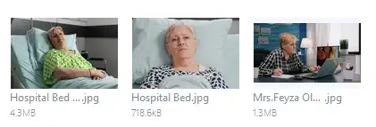
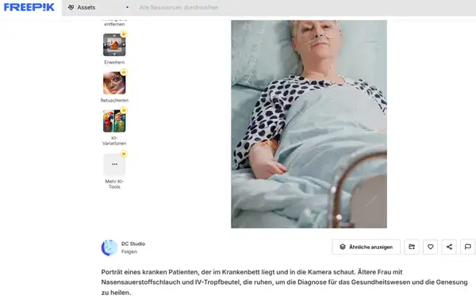
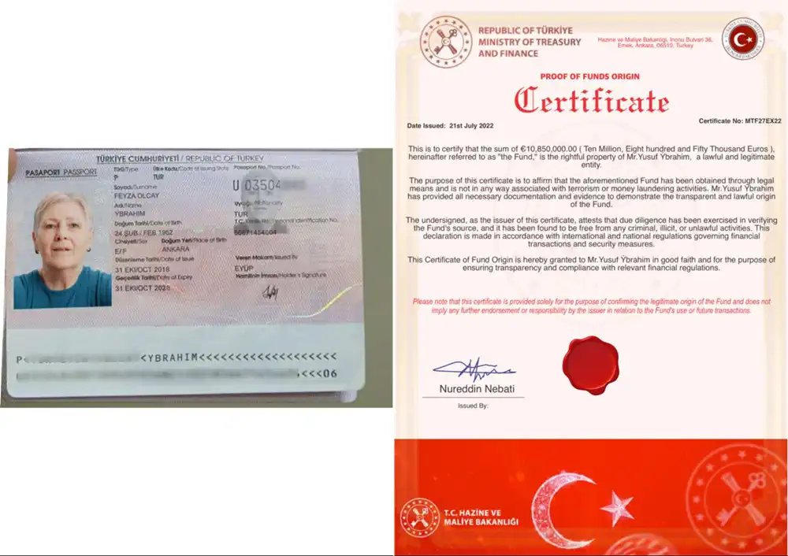
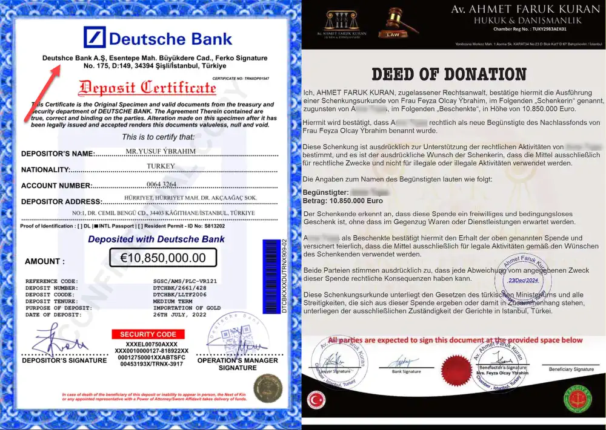
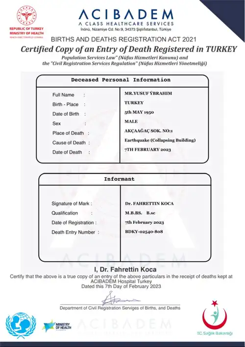

Manchmal sind Betrugsmails so kreativ, dass man fast applaudieren möchte – oder lachen muss. Eine Millionärin mit letzter Mission, Erdbeben und Charity-Projekten: Willkommen in der Welt von Frau Feyza Olcay Ýbrahim, wo das absurde Angebot von Millionen nur eine Antwort verdient!

## Betrügerische E-Mail im Wortlaut

> Hallo, meine Liebste,
>
> Ich möchte, dass du diesen Brief sehr sorgfältig liest, und ich muss mich entschuldigen, dass ich dir diese Nachricht aufgrund der Dringlichkeit dieser Angelegenheit ohne formelle Einleitung per E-Mail geschickt habe. Ich bin froh, dich zu kennen, aber Allah, der Allmächtige, kennt dich besser und weiß, warum er mich an dieser Stelle an dich verwiesen hat. Zunächst habe ich deine E-Mail und Kontaktdaten bei meiner Online-Suche nach einem guten nächsten Angehörigen gesehen, weil ich meinen letzten Wunsch unbedingt verwirklichen wollte, bevor ich bald sterbe.
>
> Ich schreibe Ihnen diese E-Mail mit schweren Tränen in den Augen und großer Trauer im Herzen. Mein Name ist Frau Feyza Olcay Ýbrahim. Ich kontaktiere Sie aus meinem Heimatland, der Türkei. Ich möchte Ihnen dies sagen, weil mir nichts anderes übrig bleibt, als es Ihnen zu sagen, da es mich berührt hat, mich Ihnen anzuvertrauen. Ich bin mit Herrn Yusuf Ýbrahim verheiratet, der acht Jahre lang beim türkischen Generalkonsulat in Toronto, Kanada, gearbeitet hat, bevor er bei dem Erdbeben in der Türkei am 6. Februar 2023 starb, bei dem 50.783 Menschen ums Leben kamen. Wir waren elf Jahre lang verheiratet und hatten keine Kinder.
>
> Er starb nach dem Erdbeben der Stärke 7,8 in der Türkei. Er wurde Opfer eines Gebäudeeinsturzes und konnte nicht überleben. Zu Lebzeiten meines verstorbenen Mannes hatte er einen Betrag von 10.850.000,00 € (zehn Millionen achthundertfünfzigtausend Euro) auf einer Bank hier in der Türkei hinterlegt. Dieses Geld liegt derzeit noch auf der Bank. Vor seinem plötzlichen Tod stellte er es für den Import von Gold aus Papua und Indonesien zur Verfügung. Kürzlich teilte mir mein Arzt mit, dass ich aufgrund einer erneuten Krebserkrankung die nächsten drei Monate nicht überleben würde. Am meisten beunruhigt mich mein Schlaganfall. Nachdem ich von meinem Zustand erfahren hatte, beschloss ich, Ihnen dieses Geld zu überlassen, damit Sie sich um die unterprivilegierten Menschen kümmern können. Sie werden das Geld so verwenden, wie ich es Ihnen hier befehle.
>
> Ich möchte, dass Sie 60 Prozent des Gesamtbetrags für Ihren persönlichen Gebrauch und für Ihren Einsatz und Ihre Hingabe für die Wohltätigkeitsarbeit verwenden, während 40 Prozent des Geldes an die Wohltätigkeitsarbeit, bedürftige Menschen von der Straße und auch an das Waisenhaus gehen. Ich bin als Waise aufgewachsen und habe niemanden als Familienmitglied. Stellen Sie außerdem sicher, dass das Haus Allahs, die Moschee, von den Mitteln unterhalten wird. Ich tue dies, damit der allmächtige Allah mir meine Sünden vergibt und meine Seele annimmt, denn ich habe so sehr unter dieser Krankheit gelitten. Sobald ich Ihre Antwort erhalte, werde ich Ihnen die Kontaktdaten der Bank hier in der Türkei mitteilen und den Bankdirektor anweisen, Ihnen eine Vollmacht auszustellen, die Sie als aktuellen Begünstigten des Geldes auf der Bank ausweist, sofern Sie mir versichern, dass Sie entsprechend den hierin dargelegten Anweisungen handeln werden.
>
> In der Hoffnung auf Ihre Antwort werde ich Sie dann so bald wie möglich zur Bank begleiten, um das Geld auf Ihr Bankkonto zu überweisen, sofern Sie es ernst genug meinen, das Projekt in Angriff zu nehmen und sich auch dafür einsetzen, denn ich glaube, ich kann Ihnen ehrlich vertrauen.
>
> Mit freundlichen Grüßen.  
> Frau Feyza Olcay Ýbrahim

## Antwort auf die Betrügerische E-Mail

Wir schreiben mal süffisant zurück und schauen, was passiert. Die E-Mail-Adresse der Scammer lautet "feyza@ybrahim.com".

> Liebe Frau Feyza Olcay Ýbrahim,
>
> vielen Dank für Ihre rührende Nachricht, die mich zutiefst berührt und mir Tränen in die Augen getrieben hat – vor Rührung und, ehrlich gesagt, vor Staunen. Es ist nicht alltäglich, dass man von solch einem großzügigen Angebot überrascht wird. Es scheint, als hätte das Schicksal – oder vielleicht auch Allah persönlich – entschieden, dass ich genau die richtige Person für diese außergewöhnliche Mission bin.
>
> Natürlich verstehe ich die Dringlichkeit dieser Angelegenheit vollkommen. Schließlich ist es ja ganz normal, wildfremde Menschen mit Millionenbeträgen und der Verantwortung für wohltätige Projekte zu betrauen, ohne sie jemals getroffen zu haben. So macht man das eben heutzutage – Vertrauen ist alles, nicht wahr?
>
> Ich bin auch beeindruckt von der sorgfältigen Recherche, die Sie offensichtlich betrieben haben, um meine Kontaktinformationen zu finden. Es ist wirklich beruhigend zu wissen, dass mein Name und meine E-Mail-Adresse in einem solch exklusiven Zusammenhang auftauchen. Das ist eine Ehre, die ich niemals erwartet hätte.
>
> Ihre detaillierten Anweisungen, wie das Geld verwendet werden soll, sind vorbildlich. Es ist wirklich eine erfrischende Abwechslung, so klare Vorgaben zu bekommen. Besonders die Aufteilung – 60 Prozent für mich, 40 Prozent für die Wohltätigkeit – finde ich absolut angemessen. Es ist offensichtlich, dass Sie den wahren Wert meiner zukünftigen Bemühungen bereits zu schätzen wissen.
>
> Ich kann Ihnen versichern, dass ich absolut bereit bin, mich dieser großartigen Aufgabe mit vollem Einsatz zu widmen – sofern es mir gelingt, meinen Lachanfall über die Ironie dieser Situation zu überwinden. Es ist einfach faszinierend, wie Sie sich die Zeit nehmen konnten, mir so eine persönliche und herzerwärmende Nachricht zu senden, während die Welt vor potenziellen Empfängern Ihres Vertrauens nur so überquillt.
>
> Falls Sie weitere Details benötigen, um mich zu „identifizieren“ oder mich auf diese abenteuerliche Reise der Großzügigkeit zu schicken, lassen Sie es mich wissen. Aber nur, wenn Sie mir versichern können, dass ich dabei nicht in einem nigerianischen Prinzessinnen-Club lande.
>
> Mit den besten Grüßen und einem herzlichen Dank für das Angebot, das ich selbstverständlich annehmen werde!
>
> Ihre zukünftige Millionärin auf Zeit

## Die erste Antwort mit Dokumenten

Eigentlich dachten wir, dass die E-Mail durch den doch recht ironischen Unterton keine Beachtung findet, aber denkste, wir bekamen eine Antwort.

Hier werden wir auf die doch längliche komplette E-Mail verzichten, aber ein Auszug wollen wir doch mal zeigen:

> Ich füge dieser E-Mail einige Kopien meiner Bilder bei, damit Sie meinen offiziellen Gesundheitszustand und meine neue Verfassung sehen können, da ich sehr krank geworden bin. Im Moment kann ich nur noch auf meinem Krankenbett schlafen, meine E-Mails abrufen und Ihnen antworten. Lassen Sie mich also bitte nicht im Stich. Ich brauche Ihre Aufrichtigkeit und Ehrlichkeit in Bezug auf diesen Wunsch und ich bete, dass der allmächtige Allah uns allen hilft. 

### Stockfotos

Zur Überzeugung werden Fotos der Dame mitgeschickt.

Die Bildersuche in Google fördert den [eigentlichen Ursprung zu Tage](https://de.freepik.com/fotos-premium/portraet-eines-kranken-patienten-der-im-krankenbett-liegt-und-in-die-kamera-schaut-aeltere-frau-mit-nasensauerstoffschlauch-und-iv-tropfbeutel-die-ruhen-um-die-diagnose-fuer-das-gesundheitswesen-und-die-genesung-zu-heilen_20982642.htm). Interessanterweise sind die gesendeten Fotos ohne Wasserzeichen, haben die Scammer einen Premium-Account beim Bilderdienst?

### Dokumente

Die die Echtheit zu unterstreichen gibt es noch Dokumente. Dazu gehören eine Ausweiskopie. Die sieht auf den ersten Blick ganz ok aus, aber die Fotos sehen bei geneuer Betrachtung doch recht gephotoshoppt aus. Dazu gibt es noch ein Zertifikat.

Da wir uns vorsichtig äußern, gibt es noch zwei Dokumente. Einmal eine Bestätigung der Deutschen Bank, mit Tippfehler, dazu auch gleich ein Vetrag zur Unterzeichnung für unsere Unterlagen.

Der "Vertrag" is dann auch das erste Dokument, was für uns angepasst wurde. Es enhält unseren Namen. Hier hat man wohl Vorlagen in der Hinterhand.

## Weiter gehts, unsere Antwort

Dann machen wir mal weiter und schreiben zurück. Bei den persönlichen Daten geben wir Phantasiedaten an, verzichten aber auf Telefonnummer und Ausweiskopie am Anfang.

> Hallo Frau Feyza Olcay Ýbrahim,
>
> es tut mir sehr leid, Sie auf den Bildern zu sehen. Ich hoffe, Sie werden den Frieden finden, welchen Sie suchen. Danke für die Zusendung der Dokumente, ich verspreche natürlich, dass ich meinen Anteil einhalten werde.
>
> Wie sollen wir weiter vorgehen? Sie haben nach meinen Daten gefragt.
>
> Ihr vollständiger Name: 
> Wohnadresse: 
> Name Ihres Landes: 
> Ihr Familienstand: Ledig  
> Ihr Alter: 54  
> Ihr Beruf: Hausfrau  
>
> Wenn Sie Hilfe benötigen oder ich etwas für Sie tun kann, melden Sie sich.
>
> Viele Grüße 

Und warten mal ab, wie es weiter geht.

## Es geht zum Bankberater und ein Totenschein

Wir bekommen erneut eine längliche Antwort. Wir sollen uns nun an den Bankberater wenden, mit extra E-Mail-Adresse. Um alles glaubwürdiger zu gestalten, gibt es sogar einen Totenschein.

> Hallo, mein lieber Begünstigter
> 
> Ich schätze Ihre Antwort in dieser Angelegenheit sehr und möchte, dass Sie wissen, dass ich meine Hoffnung und mein Vertrauen in Sie und den allmächtigen Allah im Himmel gesetzt habe. Lassen Sie mich am Ende bitte nicht im Stich, denn ich werde in ein paar Monaten sterben.
> 
> Ich habe Ihre Daten bereits an die Deutsche Bank of Turkey weitergeleitet, wo die Mittel in Höhe von 10.850.000,00 € (zehn Millionen achthundertfünfzigtausend Euro) hinterlegt wurden. Nachfolgend finden Sie die Kontaktinformationen der Bank. Bitte wenden Sie sich für die Überweisung des Geldes an Sie als neuen Begünstigten an die kontaktierte Bank. Laut Angaben der Bank werde ich Sie bitten, sie persönlich mit dem Einzahlungsschein über die unten stehende E-Mail-Adresse zu kontaktieren, damit sie Sie als neuen Begünstigten genau kennen, um die Transaktion mit Ihnen fortzusetzen und Ihnen das Geld so schnell wie möglich zu überweisen. Kontaktieren Sie sie über die unten stehende E-Mail-Adresse und teilen Sie ihnen mit, dass Sie mein benannter Begünstigter sind und dass Sie das Geld ausgezahlt haben möchten.
> 
> Beachten Sie auch, dass dieser E-Mail ein Dokument beigefügt ist. Es handelt sich um den Einzahlungsbeleg. Der Beleg wurde meinem verstorbenen Mann am Tag der Einzahlung des Geldes ausgehändigt und die Bank hat mich angewiesen, ihn Ihnen zuzusenden, damit Sie ihn ihnen schicken können, wenn Sie sie über die untenstehende E-Mail kontaktieren. Sie müssen also diese Bescheinigung zusammen mit Ihrer E-Mail senden, wenn Sie die Bank kontaktieren.
> 
> Kontaktdaten.
> 
> Herr Ahmed Shehab
> 
> info@dbsonline-tr.com
> 
> Sie müssen die oben genannte Bank-E-Mail kontaktieren und ihnen sagen, dass Sie mein benannter Begünstigter sind und dass sie Ihnen das Geld so schnell wie möglich überweisen sollen. Die Bank hat mir eine E-Mail geschickt und Ihnen geraten, ihre Büro-E-Mail zu kontaktieren, damit sie Ihnen Anweisungen geben können, wie Sie sofort mit dem Begünstigtenaustausch zwischen uns fortfahren, damit das Geld an Sie überwiesen werden kann.
> 
> Was nützt es mir in diesem Zustand, in dem ich mich jetzt befinde, die ganze Welt zu gewinnen und meine Seele an den Teufel zu verlieren, absolut nichts. Ich habe mich also entschieden und geschworen, diese Mittel den weniger Privilegierten zu geben. Ich brauche also Ihre Unterstützung, um diesen Traum zu verwirklichen, denn Allah wird mit mir sehr zufrieden sein, selbst wenn ich sterbe, wenn ich dieses Gute tue, um das Leben anderer zu verbessern.
> 
> Ich habe dieser E-Mail eine gescannte Kopie des Original-Einzahlungsbelegs beigefügt. Bitte stellen Sie sicher, dass Sie sich mit dem Einzahlungsbeleg an die Deutsche Bank of Turkey wenden, da ich angewiesen wurde, Sie darüber zu informieren.

### Unsere Antwort

Wir schreiben natürlich zurück.

> Sehr geehrte Frau feyza Ybrahim ,
> 
> vielen Dank für Ihr Vertrauen. Ich werde mich umgehend mit Herrn Ahmed Shehab in Verbindung setzen und die erforderlichen Schritte einleiten.
> 
> Für Ihr großzügiges Angebot bedanke ich mich herzlich und werde alles tun, um Ihre Wünsche zu erfüllen.
> 
> Mit vorzüglicher Hochachtung und den besten Wünschen für Ihre Gesundheit

Und natürlich schreiben wir auch dem Bankberater.

> Sehr geehrter Herr Shehab,  
> 
> ich hoffe, diese Nachricht erreicht Sie wohlbehalten. Es ist mir eine außerordentliche Ehre, mit Ihnen in dieser wichtigen Angelegenheit zusammenzuarbeiten. Die Möglichkeit, als Begünstigter eines so großzügigen Betrags in Höhe von 10.850.000,00 € eingetragen zu werden, erfüllt mich mit tiefer Dankbarkeit und Freude.  
> 
> Ich habe den Einzahlungsbeleg sorgfältig geprüft und füge ihn dieser Nachricht bei, wie es mir von Frau feyza Ybrahim ans Herz gelegt wurde. Selbstverständlich stehe ich Ihnen für alle weiteren Schritte vollumfänglich zur Verfügung und bin bereit, jeden Wunsch Ihrerseits zu erfüllen, um die Transaktion reibungslos und in Ihrem Sinne abzuwickeln.  
> 
> Ich danke Ihnen im Voraus für Ihre professionelle Unterstützung und Expertise in dieser Angelegenheit. Mit Ihrem Wissen und Ihrer Hilfe bin ich zuversichtlich, dass wir dies erfolgreich und schnell zum Abschluss bringen können.  
> 
> Mit den besten Grüßen und größter Hochachtung

## Wir brauchen einen Anwalt

Kurze E-Mails gibt es nicht bei den Scammern, die "Deutsche Bank" schreibt zurück. Die Gelder liegen bereit. Das ist ja schonmal die halbe Miete. Aber wir brauchen jetzt noch Dokumente und einen Anwalt, in der Türkei. Aber kein Thema, die Frau Ýbrahim wird sich darum kümmern. Türkische Gebührenordnung ick hör dir trapsen. Egal, wir schreiben zurück and Frau Ýbrahim, die sicher, trotz Krankenhaus und im Sterben liegend sich um diese Angelegenheit noch kümmern wird.

> Deutsche Bank Türkiye
> Esentepe Mah. Büyükdere Cad.,
> Ferko Signature No. 175, D:149,
> 34394 Şişli/İstanbul, Türkiye
> E-Mail: info@dbsonline-tr.com
> 
> Vom Schreibtisch von Herrn Ahmed Shehab.
> 
> Sehr geehrte Kundin XXX,
> 
> Wir wurden vom Direktor für Auslandsgeschäfte/elektronische Überweisungen kontaktiert, um Ihnen bezüglich der 10.850.000,00 Euro zu schreiben, die der verstorbene Herr Yusuf Ýbrahim hier bei unserer Bank hinterlegt hat. Wir möchten Sie darüber informieren, dass die Mittel Ihnen als ihrem neuen Begünstigten zugeteilt wurden und ab sofort zur Überweisung bereitstehen, da uns Frau Feyza Olcay Ýbrahim den Auftrag erteilt hat, die Überweisung auf Ihr Bankkonto so schnell wie möglich vorzunehmen.
> 
> Doch bevor dieser Betrag von dieser Bank überwiesen wird, möchten wir Sie darüber informieren, dass für diese Bank bestimmte Regeln und Vorschriften gelten und wir das ordnungsgemäße Verfahren einhalten müssen, um sicherzustellen, dass während der gesamten Transaktion mit Ihnen keine Fehler passieren.
> 
> Bevor wir mit der Überweisung des Betrags an Sie als neuen Begünstigten beginnen, benötigen wir von Ihnen als neuem Begünstigten bestimmte Dokumente, um diesen Betrag zu belegen, bevor die Überweisung auf Ihr Bankkonto erfolgt.
> 
> Diese erforderlichen Dokumente müssen in Ihrem Namen von einem Anwalt hier in der Türkei vorbereitet werden. Dabei handelt es sich um folgende Dokumente: eidesstattliche Erklärung, Begünstigtenbescheinigung, Eidesbeweis. Nachdem diese Dokumente von einem Anwalt hier in der Türkei erstellt wurden, sollte der Anwalt die drei Dokumente Frau Feyza Olcay Ýbrahim zur Ansicht vorlegen und sie als Begünstigte einsehen und unterschreiben. Nachdem sie sie unterschrieben hat, wird Ihnen empfohlen, sie ebenfalls zu unterschreiben. Anschließend sollte der Anwalt die Dokumente zu unserer Bank bringen, damit wir sie einsehen und unterschreiben können. Nachdem wir die Dokumente unterschrieben haben, beginnt die Überweisung auf Ihr Bankkonto als neuer Begünstigter der eingezahlten Gelder.
> 
> Wenn wir diese Dokumente erhalten, werden wir sie unterschreiben und die nächste Angehörige, Frau Feyza Olcay Ýbrahim, wird ebenfalls einen Teil der Dokumente unterschreiben, um zu beweisen, dass sie Ihnen als ihrem neuen Begünstigten die Gelder übergeben hat, bevor wir mit der Überweisung der Gelder auf Ihr angegebenes Bankkonto fortfahren.
> 
> Hinweis: Diese Dokumente werden von Ihnen persönlich als dem neuen Begünstigten dieser Gelder hier in unserer Bank verlangt, nicht von Frau Feyza Olcay Ýbrahim. Sie sind die Person, die die Verantwortung dafür trägt, dass die Dokumente von einem Anwalt hier in der Türkei vorbereitet werden. Außerdem wird Ihnen empfohlen, nach der Vorbereitung der Dokumente einen Teil der Dokumente zu unterzeichnen und sie uns dann an unsere E-Mail-Adresse zu senden.
> 
> Nachfolgend finden Sie die Kontaktdaten von Frau Feyza Olcay Ýbrahim, die Sie vermutlich bereits haben.
> 
> Frau Feyza Olcay Ýbrahim
> 
> feyza@ybrahim.com
> 
> Sie müssen Frau Feyza Olcay Ýbrahim kontaktieren, damit sie Ihnen hier in der Türkei einen Anwalt beschafft, der diese Dokumente so schnell wie möglich in Ihrem Namen vorbereitet. Stellen Sie sicher, dass Sie sie in Ihren nächsten E-Mails kontaktieren, damit sie in Ihrem Namen einen Anwalt finden kann, der die Vorbereitung der Dokumente übernimmt.
> 
> Sie können uns vertrauen. Das Beste im Bankensystem zu bieten, ist unsere Priorität. 
> Vielen Dank für Ihre gewohnte Geschäftsbeziehung.

### Antwort

Unsere Antwort, wir sind unsicher und fragen nach weiteren Schritten. CC geht natürlich noch an die Bank.

> Sehr geehrte Frau Ýbrahim,  
> 
> ich habe die untenstehende Antwort von der Deutschen Bank Türkiye erhalten. Leider bin ich mir nicht sicher, wie ich jetzt am besten vorgehen soll.  
> 
> Ich bitte Sie daher um Unterstützung bei den nächsten Schritten oder um eine Rückmeldung, ob weitere Maßnahmen meinerseits erforderlich sind. Insbesondere ist mir unklar, wie genau die erforderlichen Dokumente organisiert und vorbereitet werden sollen.  
> 
> Für Ihre Rückmeldung bedanke ich mich im Voraus.  
> 
> Mit freundlichen Grüßen  

