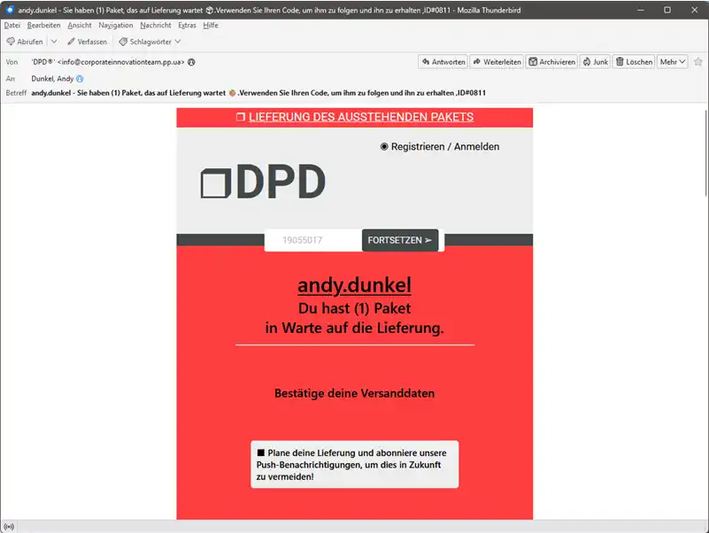
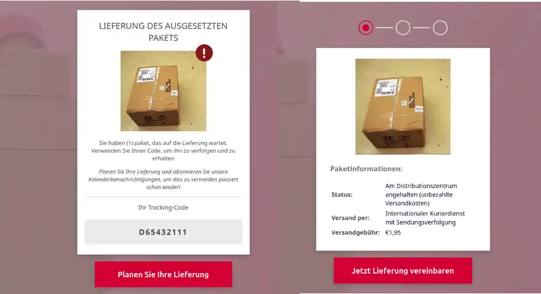
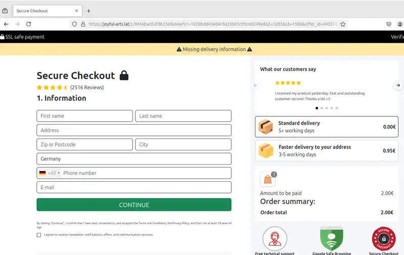
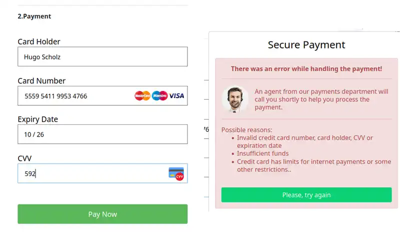
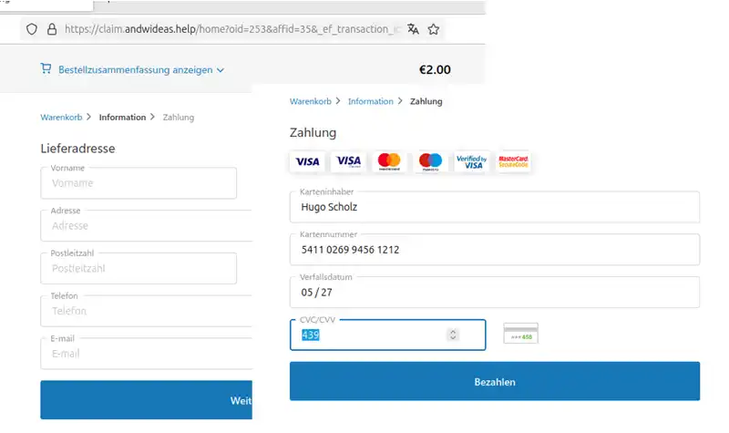
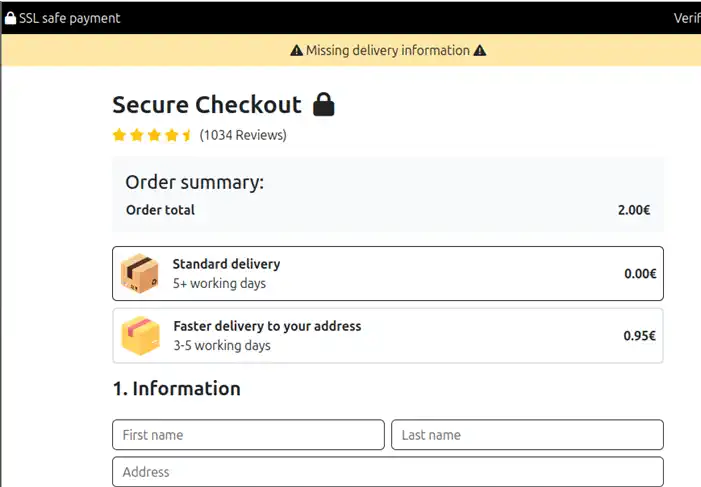

Die alte Masche, ein Paket kann nicht zugestellt werden. Mit nur 2 Euro, lässt sich die Zustellung erledigen. Eine Masche um an Kreditkarteninformationen zu gelangen.

Egal ob DPD, Deutsche Post, GLS oder ein anderes Paketunternehmen, immer wieder kommen vermeintliche Pakete nicht beim Empfänger an. Gegen eine kleine Gebühr wird mit der Neugier der Empfänger gespielt, welche sich das Paket zuschicken lassen können, obwohl nichts bestellt wurde.

Klicken wir den Link an, haben sich die Phisher durchaus Mühe gegeben. Eine Seite mit verschiedenen Schritten, professional aufbereitet, mit Animationen und Fotos des Pakets. Die Versandgebühr kostet gerade mal 1,95 Euro. Die kann man doch mal ausgeben, vielleicht ist ja ein iPhone drinnen.

Nachdem wir festgelegt haben, dass wir das Paket gerne zugeschickt bekommen wollen, den Wochentag festgelegt haben, kommen wir ans Eingemachte. Ein sicherer Checkout beginnt mit der Adresseingabe. Die Gebühr ist etwas gestiegen, statt 1,95 Euro werden nun 2 Euro fällig, aber wer will schon kleinlich sein.

Auch hier ist alles professionell aufbereitet, die Eingaben werden überprüft. Im zweiten Schritt, dann die Eingabe der Kreditkarteninformationen. Wir lassen uns eine falsche Nummer im Internet generieren und geben diese ein. Es kommt zu einem Fehler. Irgendwas passt nicht. 

Vielleicht die generierte Nummer? Wir landen in jedem Fall auf einem ähnlichen, aber anderem Formular, auf einem anderen Server. Hier können wir erneut die Daten eingeben. Machen wir natürlich.

Gedankt wird es uns nicht, dieses Mal tritt kein Fehler auf, aber wir landen erneut auf einem Formular, wieder auf einem anderen Server.

Die Vermutung liegt nahe, dass der arme Benutzer seine Daten mehrfach eingeben soll. Vielleicht zur Bestätigung, vielleicht einfach auch, damit er eine andere Kreditkarte verwendet.

Was passiert mit den Daten. Rückmeldungen haben ergeben, dass kurzer Zeit, nach der Eingabe der Kreditkartendaten, Beträge von der Kreditkarte abgebucht werden. 

Was in dem Paket ist, werden wir wohl nie erfahren. 😁

