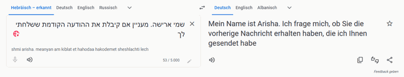
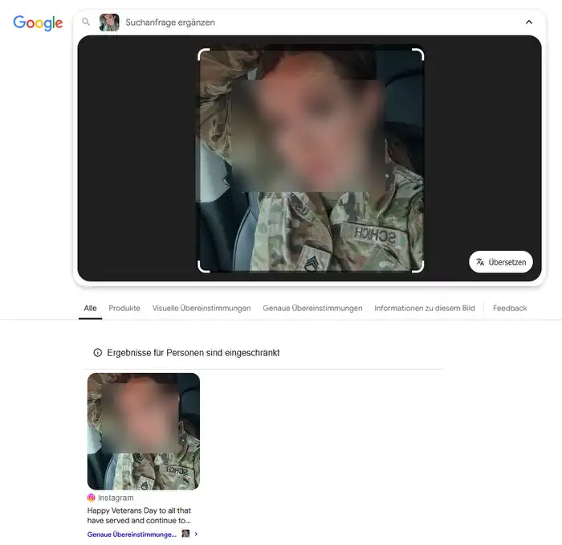
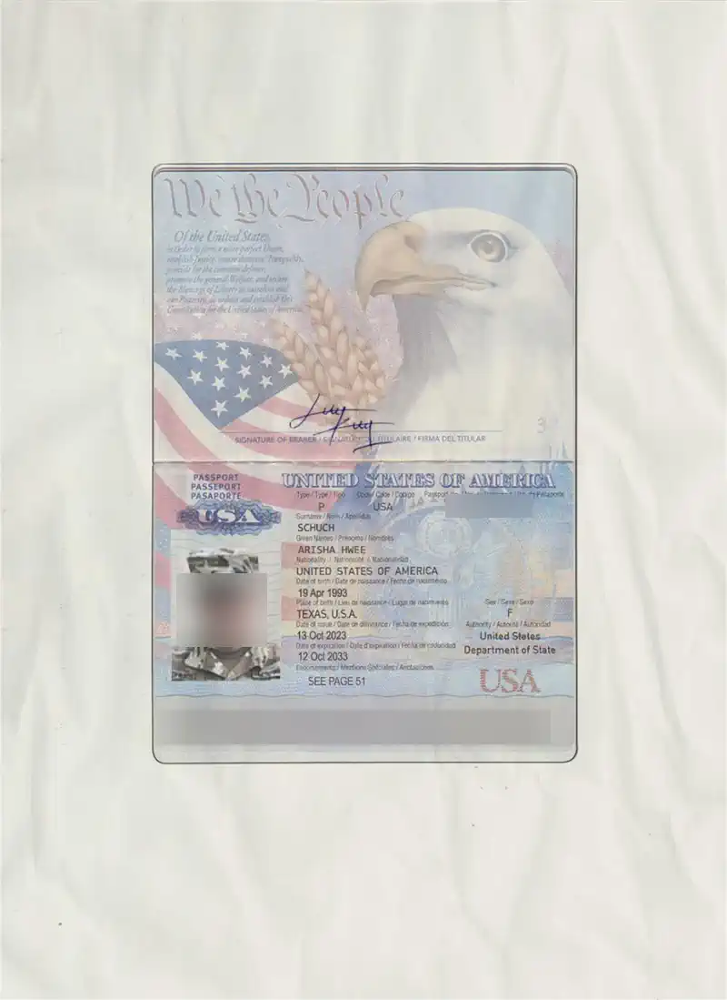

Ein Klassiker der modernen Märchenwelt: Eine 31-jährige UN-Mitarbeiterin aus Texas (oder war es die Tschechische Republik?) schreibt über ihren heldenhaften Einsatz in Syrien – und ihre plötzliche Leidenschaft für die Gastronomie. Mit 2,2 Millionen Dollar im Gepäck und einem Diplomatenkoffer als Zauberstab verspricht sie Ihnen 30 % Beteiligung. Alles, was Sie dafür tun müssen? Na klar, nur schnell helfen. Ironisch gesprochen: Wer könnte bei so viel Herz, Drama und „diplomatischem“ Aufwand widerstehen? 🧳✨

## Die erste E-Mail 

Die erste E-Mail findet sich im Spamordner wieder, seltsame Zeichen erwarten uns. Normal würden wir die E-Mail einfach löschen, aber neugierig wie wir sind, packen wir das in Google Translate.

> שמי ארישה. מעניין אם קיבלת את ההודעה הקודמת ששלחתי 

Die Sprache wird als Hebräisch erkannt. Eine vorherige Nachricht haben wir nicht erhalten, aber fragen wir mal nach.

## Die Antwort

Die erste Antwort lässt auch nicht lange auf sich warten. Schrieben wir anfangs noch an "arishaschuchw@gmail.com" kommt nun eine Antwort vom Hotmail-Account "arishaschuchw@hotmail.com". Die Antwort ist wie immer länglich. Aktuell arbeitet die Dame für die Friedenstruppen in Syrien, will da aber weg, Geld ist da, in diplomatischen Koffern verstaut und muss nur noch irgendwie nach Europa. Wir sollen helfen.

> Good moning, How are you doing? Please, I want to relocate to your country and start a new life there. That is why I wrote to you, and please read my message carefully so that you will understand it very well.
> 
> My name is Arisha Hwee Schuch, and I'm originally from the Czech Republic. I was born on American soil on April 19, 1993, in West Orange, Texas, USA. I am 31 years old, single, and never married. I currently work with the peacekeeping forces in Syria under the United Nations response team in the Middle East.
> 
> Thank you so much for your positive response. The details are that I would like to make a passionate appeal that enables you to assist me in a legitimate evacuation of $2,200,000 ( Two Million, Two Hundred Thousand United States Dollars) of my share from Syria here before my redeployment.
> 
> I am soliciting your help with this evacuation because in a few days I will be redeployed to another peacekeeping mission before my vacation, which will make me lose this fund in Syria, and that’s why I need your urgent help because I want to use it to start restaurant businesses in your country, like America and European restaurants, as soon as I arrive.
> 
> To make this process understandable to you, I have made a solid arrangement with a security logistics company that works with Red Cross and diplomatic to handle the shipment legally, so that there will be no form of risk in the process.
> 
> Meanwhile, money will be sealed and packed safely as diplomatic cargo (Diplomatic) in a Luggage to make it undetectable, and it will be delivered to you by a diplomat in your country.
> 
> However, to make this request beneficial, I have decided to give you a 30% share of the money for your support and your business, while the rest of the balance shall be my investment capital in your country, which you will assist me with.
> 
> Please, if you need more clarification, just let me know and I will explain further. But if you understand everything, kindly let me know so that we can proceed to the next stage.
> 
> Note: We are not allowed to use mobile phones; it is highly prohibited. Please kindly understand and respect the fact that we will be communicating through this medium because I am writing with you with our military computer here in Syria.
> 
> Below are my civilian and military service pictures and my passport.
> 
> I am looking forward to receiving your next reply. Have a pleasant time.
> 
> I am waiting
> Arisha

### Ausweisdokumente

Um die Sache zu unterstreichen, gibt es Ausweisdokumente, ein Bild der Dame und ein USA-Reisepass? Fangen wir mit dem Bild an, ich habe die Sache unkenntlich gemacht. Die Rückwärtssuche führt zu einem Instragram-Post, das Bild wurde von hier geklaut.

Der Ausweis ist etwas besser gemacht, hier liefert die Suche kein direktes Bild. Hier wurde vermutlich nur eine Photoshop-Vorlage verwendet und ein ähnliches Foto verwendet.

## Wir schreiben zurück

Wir wollen die Dame nicht warten lassen und schreiben neugierig, aber auch änglich zurück, immerhin sprechen wir ja über Syrien.

> Dear Arisha,
> I have to admit, your email caught me by surprise, and I’m curious how you found my contact information. Your situation sounds both urgent and unusual, which makes me want to understand more. To be honest, I am a little bit scared.
> 
> While I’m open to helping, the details you’ve shared so far make the process seem quite risky. Could you provide more information about how this would work and any assurances that everything is legitimate?
> 
> Looking forward to your response.
