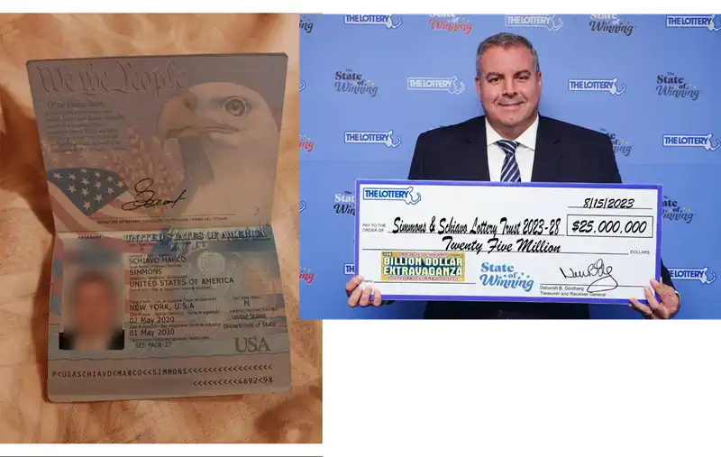

Simmons Schiavo Marco schreibt uns: Mit angeblichen Spendenversprechen von einem Lottogewinner versuchen Kriminelle, Vertrauen zu gewinnen und persönliche Daten zu stehlen.

## E-Mail

Der Klassiker, ein echter Lottogewinner wird verwendet um einen Scam aufzuziehen. Es beginnt mit einer klassischen Lock-E-Mail in der Hoffnung, dass wir antworten.

> Hallo!! Haben Sie meine vorherige E-Mail bezüglich einer Geldspende für wohltätige Zwecke in Ihrem Land erhalten?

Natürlich! Hier ist eine kompakte Zusammenfassung des Scams:  

Ein angeblicher Lottogewinner namens Simmons Schiavo Marco verspricht in einer E-Mail, 1 Million Euro für wohltätige Zwecke zu spenden. Die Empfänger werden gebeten, eine angebliche Anwältin zu kontaktieren, um die Überweisung der Gelder zu arrangieren. Dabei geben die Betrüger vor, keine Kosten oder Verpflichtungen zu verlangen, um Vertrauen aufzubauen. In Wahrheit handelt es sich um einen klassischen Betrugsversuch, bei dem persönliche Daten abgegriffen oder versteckte Gebühren eingefordert werden sollen.

> Hallo Mein Lieber Freund  
>   
> Vielen Dank für Ihre E-Mail und Ihr Interesse, mich bei diesem Wohltätigkeitsprojekt zu unterstützen. Ich muss gestehen, dass Sie großes Glück haben, diese Gelegenheit zu haben, und ich bin dankbar für Ihre Hilfsbereitschaft.  
>   
> Zuerst möchte ich mich vorstellen. Mein Name ist Simmons Schiavo Marco und ich bin 47 Jahre alt. Ich bin ein Philanthrop und Lottogewinner aus den Vereinigten Staaten von Amerika und schreibe Ihnen heute, um Ihnen einige aufregende Neuigkeiten mitzuteilen.  
>   
> Ich habe kürzlich bei der Ziehung des Jackpots im US-Lotto am 15. August 2023 gewonnen. Ich habe die satte Summe von 25 Millionen Dollar gewonnen. Nachdem ich meinen Rechtsberater finanziell beraten hatte, habe ich beschlossen, für das Jahr 2025 eine Wohltätigkeitsstiftung/ein Wohltätigkeitsprojekt zu gründen und die Gelegenheit zu nutzen, Geldzuschüsse im Wert von jeweils 1.000.000 € an 7 Personen aus verschiedenen Ländern zu vergeben, von denen 3 Begünstigte erfolgreich profitiert und ihre Spendengelder erhalten haben. Ich weiß, dass dies für Sie eine große Überraschung sein mag, aber ich versichere Ihnen, dass dies ein legitimes und ehrliches Angebot ist. Ich freue mich, Ihnen mitteilen zu können, dass Ihre E-Mail-Adresse unter den 7 glücklichen E-Mail-Adressen ausgewählt wurde. Das Rechtsberatung Programm hat Sie nach dem Zufallsprinzip ausgewählt und zu einem der glücklichen Menschen erklärt, die einen Geldzuschuss von 1.000.000 € erhalten.  
>   
> Ich glaube aufrichtig, dass mein Lotteriegewinn ein Geschenk Gottes war, und ich möchte Gottes Willen erfüllen, indem ich diese Spende mache, und wie sich herausstellt, ist Ihre E-Mail-Adresse einer der Empfänger, die die Spendengelder erhalten werden. Dies soll mir helfen, Einzelpersonen, Wohltätigkeitsorganisationen und Organisationen zu erreichen. Ich hoffe, Sie verwenden die Mittel gut, indem Sie einen Teil davon in Waisenhäuser und Pflegeheime investieren und auch die weniger Privilegierten in Ihrem Land erreichen.  
>   
> Ich wollte Sie nur wissen lassen, dass Sie aus keinem Grund irgendwohin reisen müssen, da mein Anwalt alle Angelegenheiten in Ihrem Namen behandelt. Mein Anwalt ist ein angesehener Anwalt mit umfassender Erfahrung in Schenkungs-/Spenden Angelegenheiten. Sie wird den gesamten Papierkram erledigen und die sofortige Freigabe der Überweisung Ihrer Spendengelder an Sie beantragen. Ich verlange kein Geld von Ihnen, da ich mich um alle anfallenden Kosten kümmere. Was ich von Ihnen erwarte, ist Vertrauen, Ehrlichkeit und die Bereitschaft, die Mittel für wohltätige und benachteiligte Zwecke zu verwenden.  
>   
> Um den Auszahlungsprozess der ausschließlich an Sie gespendeten Mittel in Höhe von 1.000.000 € zu erleichtern, sollten Sie meine Anwältin unter der unten angegebenen E-Mail-Adresse oder Telefonnummer kontaktieren. Sie wird Ihnen den Prozess und die Richtlinien zur Beantragung der Spendengelder erläutern. Sie wird Ihnen das erforderliche Dokument zur Unterschrift zusenden, aus dem hervorgeht, dass Ihnen das Geld gespendet wurde, als Beweis dafür, dass Sie wirklich der rechtmäßige Empfänger der Spendengelder sind.  
>   
> Ich hoffe, Sie werden in der Lage sein, das Geld in Ihrem Land klug und umsichtig einzusetzen und so weit wie möglich zu versuchen, anderen in finanzieller Not zu helfen. Bitte tragen Sie Ihren Teil dazu bei, die Armut in Ihrer Gemeinde zu lindern, und helfen Sie so vielen Menschen wie möglich, sobald Sie dieses Geld auf Ihrem Konto haben, denn das ist das einzige Ziel, das wir Ihnen mit der Spende dieses Geldes überhaupt geben.  
>   
> Wenden Sie sich an meinen Anwalt, um das Überweisungs Dokument zu unterzeichnen, damit Sie die Spendengelder für das Projekt auf Ihrem Bankkonto erhalten können.  
>   
> Anwaltskanzlei: LEGAL COMPLIANCE LIMITED  
> Anwältin Frau Elisabeth Massi  
> E-Mail: elisabethmassi78@gmail.com  
> WhatsApp-Nummer: +1 (805) 657-7932  
>   
> Ich habe dieser Nachricht meinen gültigen Personalausweis und Fotos beigefügt, um sicherzustellen, dass unsere Kommunikation echt ist, und um guten Willen zu zeigen. Bitte geben Sie diese Dokumente ohne meine Erlaubnis nicht an andere weiter.  
>   
> Ich möchte, dass Sie sich bei mir melden, sobald Sie meine Anwältin kontaktiert haben. Ich werde sie dann kontaktieren, um die notwendigen Formalitäten zu erledigen, damit Ihnen die Mittel überwiesen werden können und Sie so bald wie möglich mit dem Projekt beginnen können.  
>   
> Mit freundlichen Grüßen  
> Simmons Schiavo Marco  

Die E-Mail kommt von "simmonsschiavomarco@gmail.com".

### Foto und Pass

Wie es sich gehört, werden auch Foto und Pass mitgeliefert. Der Pass sieht gut aus, das Foto findet man so [auch im Internet](https://www.cbsnews.com/boston/news/mass-lottery-50-dollar-ticket-winner-25-million-prize-billion-dollar-extravaganza/).

## Wir antworten

Natürlich antworten wir sofort, schließlich will man ja nicht unhöflich wirken! Doch kaum ein Tag vergeht, schon werden wir mit einer nachdrücklichen Nachfrage bombardiert. Offenbar brennt es ihnen geradezu unter den Nägeln, die großzügigen Millionen so schnell wie möglich unters Volk zu bringen. Wie selbstlos!

Wir können unsere Freude kaum verbergen!

> Liebe Frau Massi,    
>   
> ich kann meine Begeisterung kaum in Worte fassen! Es ist eine wahre Ehre und ein unbeschreibliches Glück, für dieses außergewöhnliche Wohltätigkeitsprojekt ausgewählt worden zu sein. Ich bin Ihnen und Herrn Simmons Schiavo Marco unendlich dankbar für diese großzügige Gelegenheit, die mein Leben und das Leben vieler anderer verändern wird.    
>   
> Bitte teilen Sie mir mit, welche Dokumente oder Informationen Sie von mir benötigen, um den weiteren Prozess schnellstmöglich abzuschließen. Ich möchte natürlich alles tun, um sicherzustellen, dass diese wunderbare Spende so bald wie möglich für wohltätige Zwecke genutzt werden kann.    
>   
> Vielen Dank für Ihre Mühe und Ihre Arbeit, dieses großartige Projekt zu unterstützen. Ich freue mich auf Ihre baldige Rückmeldung!    
>   
> Mit herzlichen Grüßen,

## Die Anwältin antwortet

Natürlich lassen sie uns nicht lange warten, zack, die Antwort ist da! Und was für eine: episch in ihrer Länge, fast schon ein kleines Epos der Dreistigkeit. Klar, wir sollen mal wieder unser komplettes Leben auf dem Silbertablett servieren. Name, Adresse, Bankdaten, der gute alte Personalausweis, fehlt nur noch die Einladung zum Abendessen und der Pin fürs Handy. Alles natürlich „ganz wichtig“ für die Dokumente und den „rechtlichen Ablauf“. Denn wie soll man ohne unsere Bankverbindung eine Million überweisen? Das geht ja gar nicht! 🙃

> Hallo  
>     Ich möchte Ihnen sehr dafür danken, dass Sie sich bezüglich des rechtlichen Verfahrens zur Spende an mich gewandt haben. Mein Name ist Elisabeth Massi und ich bin die Anwältin, die Herrn Simmons Schiavo Marco vertritt. Ich verstehe, dass Sie sich nach der Spende in Höhe von 1.000.000 € für wohltätige Zwecke erkundigen. Als Rechtsspezialistin bin ich hier, um Sie während des gesamten Rechtsverfahrens zu unterstützen und zu beraten. Ich möchte Sie darüber informieren, dass Herr Simmons Schiavo Marco die Spendengelder genehmigt hat, und ich verpflichte mich, sicherzustellen, dass alle erforderlichen rechtlichen Unterlagen vorhanden sind, um die reibungslose Überweisung der Mittel auf Ihr angegebenes Bankkonto nach Unterzeichnung der erforderlichen Dokumente zu ermöglichen. Bevor ich jedoch mit dem Verfahren fortfahre, möchte ich Sie um zusätzliche Informationen bitten, um sicherzustellen, dass alle rechtlichen Dokumente in Ordnung sind und alles gut geht. Bitte stellen Sie mir die folgenden Informationen zur   
> Verfügung, damit ich das erforderliche Verfahren vor dem Obersten Gericht fortsetzen kann.  
>   
> Vollständiger Name:  
> Land:  
> Staat:  
> Alter:  
> Personenstand:  
> Telefonnummer:  
> Scan-Kopie des Personalausweises  
>   
> Erforderliche Bankdaten:  
>   
> 1. Name des Bankinhabers...  
> 2. Bankkontonummer...  
> 3. Name der Bank.................  
> 4. IFSC-Code...................  
> 5. Adresse der Bank.................  
>   
> Sobald Sie mir die benötigten Informationen zur Verfügung stellen, werde ich mit sofortiger Wirkung fortfahren. Wenn Sie die Verfahren befolgen, erhalten Sie Ihre Mittel so schnell wie möglich.  
>   
> Vielen Dank und ich hoffe, bald von Ihnen zu hören.  
>   
> Vielen Dank  
> Barr. Elisabeth Massi  
> LEGAL COMPLIANCE LIMITED  
> +1 (805) 657-7932  

## Wir verlangen ein Selfie

Heute geben wir uns mal skeptisch und fragen nach einem Selfie mit Zeitung und oder Webeite.

> Guten Tag Frau Massi,  
>  
> vielen Dank für Ihre Nachricht und das großzügige Angebot. Allerdings bin ich ein äußerst sicherheitsbewusster Mensch und möchte mich vergewissern, dass alles seine Richtigkeit hat. Daher benötige ich zunächst ein Selfie von Ihnen, auf dem Sie die aktuelle Tageszeitung oder Internetseite mit deutlich sichtbarem Datum in der Hand halten. Nur so kann ich sicherstellen, dass ich keinem Betrug zum Opfer falle. Ich hoffe, Sie verstehen meine Vorsicht.  
>  
> Mit freundlichen Grüßen,  

## Kein Selfie und andere Kontaktaufnahme

Leider blieb uns das ersehnte Selfie mit Tageszeitung und Lottoschein verwehrt, offensichtlich war Frau Massi an diesem Tag nicht besonders fotogen. 😄 Wir haben aber dennoch nach und antworten also Hugo, Prolet, aus Wanne-Eickel.

> Moin,  
>   
> was geht ab? Geldspende und so? Hab nix von dir vorher jelesen, ehrlich jetz. Wat willst'n genau, Kollege? Is dat hier seriös oder machst du Faxen? Schreib ma klar und deutlich, sonst glaub ich dat eher nich!  
>   
> Hau rein,  
> Hugo  
> (Wanne-Eickel's Finest)  

Wir bekommen die gleiche Antwort wie oben und schreiben erneut zurück.

> Hallo Simmons,  
>   
> boah, ich kann dat ja gar nich glauben! So was is mir ja noch nie passiert! Ich mein, wer gewinnt schon so viel Geld und denkt dann an Leute wie mich? Du bist echt n ganz feiner Kerl, ehrlich!  
>   
> Dat Geld würd ich natürlich genau so einsetzen, wie du sagst, für die armen Leutchen hier im Viertel, Waisenhäuser und so.  
>   
> Ich schreib deiner Anwältin direkt, wat die braucht, und schick alles hin.  
>   
> Danke nochmal, Simmons, du bist echt der Hammer!  
>   
> Beste Grüße  
> Hugo aus Wanne-Eickel  

## Neuer Kontaktversuch mit der Advokatin

Wir geben uns gutgläubig und lassen Hugo die Sache regeln. Hugo, der Mann fürs Grobe und Bürokratische, hat sich direkt an Frau Massi gewandt. Und wie könnte es anders sein: höflich, vertrauensvoll und mit einem Hauch Ruhrpott-Charme, der jeden Winkeladvokaten dahinschmelzen lässt.  

Sein Plan ist simpel: "Kein Bürokrat, aber alles sauber." Denn wenn einer in Wanne-Eickel weiß, wie man mit großen Summen umgeht, dann ist es Hugo, zumindest solange es um Kumpels, Currywurst und ’nen schnellen Pils an der Ecke geht.  

Jetzt warten wir gespannt, wie Frau Massi auf Hugos herzerwärmende Mail reagiert. Wird sie beeindruckt sein von so viel Bodenständigkeit? 😄  

> Hallo Frau Massi,    
>   
> mein Name is Hugo, und der Simmons hat mir von Ihnen erzählt. Wat für ein Glück, ey, ich wurde ausgewählt, um 1.000.000 € zu kriegen!    
>   
> Er hat gesagt, Sie sind die Advokatin, die dat alles regelt. Ich wollt mich melden, damit wir den Papierkram schnell hinkriegen. Sagen Sie mir einfach, wat Sie von mir brauchen und wie wir dat mit dem Geld machen. Ich bin kein Bürokrat, ehrlich, aber ich will, dat alles sauber läuft.    
>   
> Also, Frau Massi, ich vertrau Ihnen, dass Sie mir helfen, und ich freu mich schon, wat Gutes mit dem Geld zu tun. Schreiben Sie mir, wenn ich was machen soll.  
>   
> Bester Gruß  
> Hugo    
> (Wanne-Eickel forever)  

### Massi will's wissen: Digitaler Striptease

Prompt kommt die Antwort: Natürlich sollen wir uns auch hier einem digitalen Striptease unterziehen und all unsere persönlichen Daten preisgeben, inklusive Scan des Personalausweises. Sogar der IFSC-Code der Bank wird verlangt, was auch immer das sein mag. Klingt doch seriös, oder? 🙃

> Hallo  
>     Ich möchte Ihnen sehr dafür danken, dass Sie sich bezüglich des rechtlichen Verfahrens zur Spende an mich gewandt haben. Mein Name ist Elisabeth Massi und ich bin die Anwältin, die Herrn Simmons Schiavo Marco vertritt. Ich verstehe, dass Sie sich nach der Spende in Höhe von 1.000.000 € für wohltätige Zwecke erkundigen. Als Rechtsspezialistin bin ich hier, um Sie während des gesamten Rechtsverfahrens zu unterstützen und zu beraten. Ich möchte Sie darüber informieren, dass Herr Simmons Schiavo Marco die Spendengelder genehmigt hat, und ich verpflichte mich, sicherzustellen, dass alle erforderlichen rechtlichen Unterlagen vorhanden sind, um die reibungslose Überweisung der Mittel auf Ihr angegebenes Bankkonto nach Unterzeichnung der erforderlichen Dokumente zu ermöglichen. Bevor ich jedoch mit dem Verfahren fortfahre, möchte ich Sie um zusätzliche Informationen bitten, um sicherzustellen, dass alle rechtlichen Dokumente in Ordnung sind und alles gut geht. Bitte stellen Sie mir die folgenden Informationen zur   
> Verfügung, damit ich das erforderliche Verfahren vor dem Obersten Gericht fortsetzen kann.  
>   
> Vollständiger Name:  
> Land:  
> Staat:  
> Alter:  
> Personenstand:  
> Telefonnummer:  
> Scan-Kopie des Personalausweises  
>   
> Erforderliche Bankdaten:  
>   
> 1. Name des Bankinhabers...  
> 2. Bankkontonummer...  
> 3. Name der Bank.................  
> 4. IFSC-Code...................  
> 5. Adresse der Bank.................  
>   
> Sobald Sie mir die benötigten Informationen zur Verfügung stellen, werde ich mit sofortiger Wirkung fortfahren. Wenn Sie die Verfahren befolgen, erhalten Sie Ihre Mittel so schnell wie möglich.  
>   
> Vielen Dank und ich hoffe, bald von Ihnen zu hören.  
>   
> Vielen Dank  
> Barr. Elisabeth Massi  
> LEGAL COMPLIANCE LIMITED  
> +18056577932  

### Wir sind skeptisch

Natürlich bleiben wir skeptisch. Höflich fragen wir nach einem offiziellen Nachweis, man will ja schließlich sicher sein, dass das großzügige Millionenangebot tatsächlich echt ist. Auch Hugo hält sich diesmal zurück und spielt den höflichen Interessenten. Mal sehen, wie überzeugend Frau Massi ihre Spendenabsichten untermauern kann. 😉

> Sehr geehrte Frau Massi,  
>   
> vielen Dank für Ihre Nachricht und das großzügige Angebot! Natürlich bin ich interessiert, wohltätige Projekte zu unterstützen. Allerdings habe ich schon viel über Betrugsversuche im Internet gehört, daher möchte ich sicherstellen, dass alles seine Richtigkeit hat.  
>   
> Könnten Sie mir bitte ein offizielles Dokument oder einen Nachweis zusenden, der die Spende und deren Herkunft bestätigt? Das würde mir sehr helfen, Vertrauen in die Sache zu fassen.  
>   
> Vielen Dank im Voraus für Ihre Mühe, ich freue mich auf Ihre Rückmeldung.  

### Wir antworten dem guten Simmons

Auch dem guten Simmons schreiben wir zurück, höflich, aber mit der richtigen Portion Hugo-Charme. Schließlich wollen wir sicherstellen, dass dieses großzügige Millionenprojekt auch wirklich Hand und Fuß hat. Und natürlich lassen wir uns dabei nicht nehmen, nach einem offiziellen Nachweis zu fragen. 

Man will ja schließlich wissen, wo die versprochenen Millionen herkommen, wir sind ja nicht von gestern! 😏

> Ey Herr Schiavo Marco,  
>   
> erstmal Respekt für die fetten Worte und die guten Wünsche, so viel Liebe kriegt man ja nicht mal zu Weihnachten! Ich hab mich natürlich direkt bei Ihrer Anwältin gemeldet, ganz seriös und mit feiner Sprache, glauben Sie mir, selbst Goethe hätte applaudiert.  
>   
> Aber mal Butter bei die Fische: Bevor wir hier mit Ihrem Millionen-Projekt loslegen, müssen wir noch ein paar Sachen klären. Ich mein, bei so einer Riesennummer will ich schon sicher sein, dass alles sauber läuft. Können Sie oder Ihre Anwältin mir was Offizielles schicken, so ein Papier, das die Spende bestätigt und zeigt, wo die Kohle herkommt? Wäre Bombe!  
>   
> Bin gespannt, was da noch geht, lassen Sie uns zusammen was Großes reißen!  
>   
> Beste Grüße aus’m Herzen von Wanne-Eickel,  
> Ihr Hugo  

## Der WhatsApp-Beweis: Rudolf Steinkellner hat bereits die Million

Unsere Skepsis bleibt unerschütterlich, auch wenn Frau Massi versucht, uns mit einem überzeugenden WhatsApp-Screenshot von einem glücklichen "Begünstigten" aus Deutschland zu beeindrucken. Ein Herr Rudolf Steinkellner bedankt sich rührend für seine frisch erhaltenen 1 Million Euro. 

> Hallo Hugo   
> Vielen Dank für Ihre E-Mail. Der Inhalt wurde verstanden. Ich verstehe, dass Sie möglicherweise Bedenken bezüglich dieser Transaktion haben, aber Sie können sicher sein, dass dieses Spendenprojekt echt und legitim ist und es keinen Grund zur Sorge bezüglich dieser Transaktion gibt. Als Ihr Anwalt ist es mein Hauptziel, Sie während dieser Transaktion transparent zu beraten und zu unterstützen und sicherzustellen, dass alles reibungslos abläuft. Sie müssen mir Ihre Informationen und Dokumente zur Verfügung stellen. Dadurch kann ich die erforderlichen rechtlichen Verfahren vor dem Obersten Gerichtshof einleiten, um die Unterlagen zu Ihrer großzügigen Spende vorzubereiten und Ihnen das Dokument zur Überprüfung und Unterschrift zuzusenden.  
>   
> Ich möchte Ihnen mein WhatsApp-Gespräch mit einem der Begünstigten aus Deutschland zeigen, der heute seine Spende erhalten hat  
>   
> Sobald Sie mir die benötigten Informationen zur Verfügung stellen, werde ich mit sofortiger Wirkung fortfahren.   
>   
> Vielen Dank und ich hoffe, bald von Ihnen zu hören.  
>   
> Vielen Dank  
> Barr. Elisabeth Massi  
> LEGAL COMPLIANCE LIMITED  
> +18056577932  

### Wir wollen Kontakt mit Rudolf!

Ein Screenshot als Beweis? Nee, damit geben wir uns nicht zufrieden. Hugo will’s genau wissen und fordert den direkten Draht zu Rudolf ein, WhatsApp-Nummer inklusive. Schließlich klärt man so was am besten persönlich, oder?

> Ey Frau Massi,    
>   
> erstmal Respekt für den Screenshot, das sieht ja richtig amtlich aus! Der gute Rudolf hat also seine Mille kassiert, läuft bei ihm! Aber Sie wissen ja, man will immer auf Nummer sicher gehen.    
>   
> Könnten Sie mir vielleicht Rudolfs WhatsApp-Nummer schicken? Würd mich echt mal interessieren, wie er so drauf ist und ob das alles wirklich so easy gelaufen ist. Ist ja auch für mich wichtig, wenn ich hier in die große Millionärsrunde einsteige, dass ich weiß, worauf ich mich einlasse.    
>   
> Also, her mit der Nummer, wir klären das mal direkt mit dem Kollegen!    
>   
> Beste Grüße aus’m Pott,    
> Ihr Hugo    
