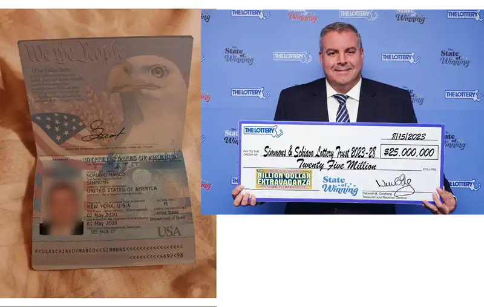

Simmons Schiavo Marco schreibt uns: Mit angeblichen Spendenversprechen von einem Lottogewinner versuchen Kriminelle, Vertrauen zu gewinnen und persönliche Daten zu stehlen.

## E-Mail

Der Klassiker, ein echter Lottogewinner wird verwendet um einen Scam aufzuziehen. Es beginnt mit einer klassischen Lock-E-Mail in der Hoffnung, dass wir antworten.

> Hallo!! Haben Sie meine vorherige E-Mail bezüglich einer Geldspende für wohltätige Zwecke in Ihrem Land erhalten?

Natürlich! Hier ist eine kompakte Zusammenfassung des Scams:  

Ein angeblicher Lottogewinner namens Simmons Schiavo Marco verspricht in einer E-Mail, 1 Million Euro für wohltätige Zwecke zu spenden. Die Empfänger werden gebeten, eine angebliche Anwältin zu kontaktieren, um die Überweisung der Gelder zu arrangieren. Dabei geben die Betrüger vor, keine Kosten oder Verpflichtungen zu verlangen, um Vertrauen aufzubauen. In Wahrheit handelt es sich um einen klassischen Betrugsversuch, bei dem persönliche Daten abgegriffen oder versteckte Gebühren eingefordert werden sollen.

> Hallo Mein Lieber Freund Anne Maria  
>   
> Vielen Dank für Ihre E-Mail und Ihr Interesse, mich bei diesem Wohltätigkeitsprojekt zu unterstützen. Ich muss gestehen, dass Sie großes Glück haben, diese Gelegenheit zu haben, und ich bin dankbar für Ihre Hilfsbereitschaft.  
>   
> Zuerst möchte ich mich vorstellen. Mein Name ist Simmons Schiavo Marco und ich bin 47 Jahre alt. Ich bin ein Philanthrop und Lottogewinner aus den Vereinigten Staaten von Amerika und schreibe Ihnen heute, um Ihnen einige aufregende Neuigkeiten mitzuteilen.  
>   
> Ich habe kürzlich bei der Ziehung des Jackpots im US-Lotto am 15. August 2023 gewonnen. Ich habe die satte Summe von 25 Millionen Dollar gewonnen. Nachdem ich meinen Rechtsberater finanziell beraten hatte, habe ich beschlossen, für das Jahr 2025 eine Wohltätigkeitsstiftung/ein Wohltätigkeitsprojekt zu gründen und die Gelegenheit zu nutzen, Geldzuschüsse im Wert von jeweils 1.000.000 € an 7 Personen aus verschiedenen Ländern zu vergeben, von denen 3 Begünstigte erfolgreich profitiert und ihre Spendengelder erhalten haben. Ich weiß, dass dies für Sie eine große Überraschung sein mag, aber ich versichere Ihnen, dass dies ein legitimes und ehrliches Angebot ist. Ich freue mich, Ihnen mitteilen zu können, dass Ihre E-Mail-Adresse unter den 7 glücklichen E-Mail-Adressen ausgewählt wurde. Das Rechtsberatung Programm hat Sie nach dem Zufallsprinzip ausgewählt und zu einem der glücklichen Menschen erklärt, die einen Geldzuschuss von 1.000.000 € erhalten.  
>   
> Ich glaube aufrichtig, dass mein Lotteriegewinn ein Geschenk Gottes war, und ich möchte Gottes Willen erfüllen, indem ich diese Spende mache, und wie sich herausstellt, ist Ihre E-Mail-Adresse einer der Empfänger, die die Spendengelder erhalten werden. Dies soll mir helfen, Einzelpersonen, Wohltätigkeitsorganisationen und Organisationen zu erreichen. Ich hoffe, Sie verwenden die Mittel gut, indem Sie einen Teil davon in Waisenhäuser und Pflegeheime investieren und auch die weniger Privilegierten in Ihrem Land erreichen.  
>   
> Ich wollte Sie nur wissen lassen, dass Sie aus keinem Grund irgendwohin reisen müssen, da mein Anwalt alle Angelegenheiten in Ihrem Namen behandelt. Mein Anwalt ist ein angesehener Anwalt mit umfassender Erfahrung in Schenkungs-/Spenden Angelegenheiten. Sie wird den gesamten Papierkram erledigen und die sofortige Freigabe der Überweisung Ihrer Spendengelder an Sie beantragen. Ich verlange kein Geld von Ihnen, da ich mich um alle anfallenden Kosten kümmere. Was ich von Ihnen erwarte, ist Vertrauen, Ehrlichkeit und die Bereitschaft, die Mittel für wohltätige und benachteiligte Zwecke zu verwenden.  
>   
> Um den Auszahlungsprozess der ausschließlich an Sie gespendeten Mittel in Höhe von 1.000.000 € zu erleichtern, sollten Sie meine Anwältin unter der unten angegebenen E-Mail-Adresse oder Telefonnummer kontaktieren. Sie wird Ihnen den Prozess und die Richtlinien zur Beantragung der Spendengelder erläutern. Sie wird Ihnen das erforderliche Dokument zur Unterschrift zusenden, aus dem hervorgeht, dass Ihnen das Geld gespendet wurde, als Beweis dafür, dass Sie wirklich der rechtmäßige Empfänger der Spendengelder sind.  
>   
> Ich hoffe, Sie werden in der Lage sein, das Geld in Ihrem Land klug und umsichtig einzusetzen und so weit wie möglich zu versuchen, anderen in finanzieller Not zu helfen. Bitte tragen Sie Ihren Teil dazu bei, die Armut in Ihrer Gemeinde zu lindern, und helfen Sie so vielen Menschen wie möglich, sobald Sie dieses Geld auf Ihrem Konto haben, denn das ist das einzige Ziel, das wir Ihnen mit der Spende dieses Geldes überhaupt geben.  
>   
> Wenden Sie sich an meinen Anwalt, um das Überweisungs Dokument zu unterzeichnen, damit Sie die Spendengelder für das Projekt auf Ihrem Bankkonto erhalten können.  
>   
> Anwaltskanzlei: LEGAL COMPLIANCE LIMITED  
> Anwältin Frau Elisabeth Massi  
> E-Mail: elisabethmassi78@gmail.com  
> WhatsApp-Nummer: +1 (805) 657-7932  
>   
> Ich habe dieser Nachricht meinen gültigen Personalausweis und Fotos beigefügt, um sicherzustellen, dass unsere Kommunikation echt ist, und um guten Willen zu zeigen. Bitte geben Sie diese Dokumente ohne meine Erlaubnis nicht an andere weiter.  
>   
> Ich möchte, dass Sie sich bei mir melden, sobald Sie meine Anwältin kontaktiert haben. Ich werde sie dann kontaktieren, um die notwendigen Formalitäten zu erledigen, damit Ihnen die Mittel überwiesen werden können und Sie so bald wie möglich mit dem Projekt beginnen können.  
>   
> Mit freundlichen Grüßen  
> Simmons Schiavo Marco  

Die E-Mail kommt von "simmonsschiavomarco@gmail.com".

### Foto und Pass

Wie es sich gehört, werden auch Foto und Pass mitgeliefert. Der Pass sieht gut aus, das Foto findet man so [auch im Internet](https://www.cbsnews.com/boston/news/mass-lottery-50-dollar-ticket-winner-25-million-prize-billion-dollar-extravaganza/).

## Wir antworten

Natürlich antworten wir sofort – schließlich will man ja nicht unhöflich wirken! Doch kaum ein Tag vergeht, schon werden wir mit einer nachdrücklichen Nachfrage bombardiert. Offenbar brennt es ihnen geradezu unter den Nägeln, die großzügigen Millionen so schnell wie möglich unters Volk zu bringen. Wie selbstlos!

Wir können unsere Freude kaum verbergen!

> Liebe Frau Massi,    
>   
> ich kann meine Begeisterung kaum in Worte fassen! Es ist eine wahre Ehre und ein unbeschreibliches Glück, für dieses außergewöhnliche Wohltätigkeitsprojekt ausgewählt worden zu sein. Ich bin Ihnen und Herrn Simmons Schiavo Marco unendlich dankbar für diese großzügige Gelegenheit, die mein Leben und das Leben vieler anderer verändern wird.    
>   
> Bitte teilen Sie mir mit, welche Dokumente oder Informationen Sie von mir benötigen, um den weiteren Prozess schnellstmöglich abzuschließen. Ich möchte natürlich alles tun, um sicherzustellen, dass diese wunderbare Spende so bald wie möglich für wohltätige Zwecke genutzt werden kann.    
>   
> Vielen Dank für Ihre Mühe und Ihre Arbeit, dieses großartige Projekt zu unterstützen. Ich freue mich auf Ihre baldige Rückmeldung!    
>   
> Mit herzlichen Grüßen,