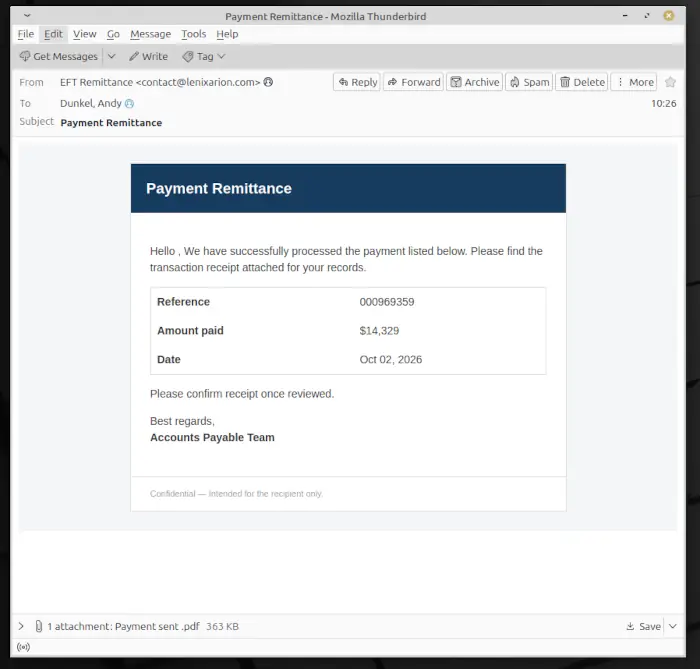
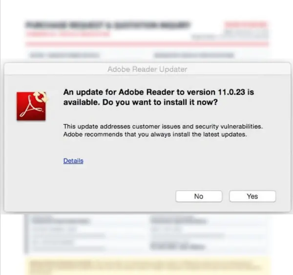
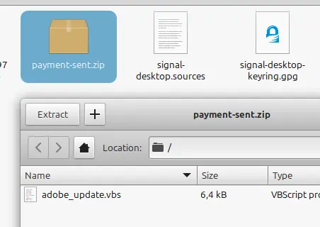
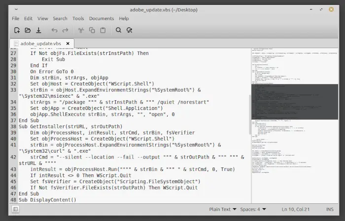

14.329 Dollar sind angeblich eingegangen. Man müsse nur noch den angehängten Beleg prüfen und den Empfang bestätigen. Das klingt nach einer Aufgabe für die Buchhaltung – oder nach einem sehr teuren Doppelklick.

Die E-Mail mit dem Betreff **„Payment Remittance“** führt über ein vermeintliches PDF zu einem ZIP-Archiv. Darin steckt kein Dokument, sondern das VBScript `adobe_update.vbs`. Wer es startet und die anschließende Windows-Rechteabfrage bestätigt, erlaubt dem Skript, eine weitere Datei aus dem Internet zu laden und als MSI-Paket unbemerkt zu installieren.

Wir haben die sichtbare Angriffskette, das vollständige Skript und die nachgeladene MSI-Datei statisch untersucht. **Ausgeführt wurde dabei keine der Dateien.**

## Die E-Mail: 14.329 Dollar gegen die Aufmerksamkeit

Die Nachricht gibt sich als automatische Zahlungsbestätigung eines „Accounts Payable Team“ aus. Eine Referenznummer, das aktuelle Datum und der Betrag von **14.329 US-Dollar** sollen den Eindruck eines echten Geschäftsvorgangs erzeugen.



Der Text bleibt bewusst allgemein:

> We have successfully processed the payment listed below. Please find the transaction receipt attached for your records.

Und am Ende folgt die kleine Handlungsaufforderung:

> Please confirm receipt once reviewed.

Ein Firmenname, eine konkrete Rechnung, eine Bestellung oder ein Ansprechpartner fehlen. Genau das macht den Köder universell einsetzbar: In Unternehmen reichen ein unerwarteter Zahlungseingang und ein angeblicher Beleg oft aus, um Neugier oder Zeitdruck zu erzeugen.

Auch der Absender ist ein Warnsignal. Angezeigt wird „EFT Remittance“, tatsächlich stammt die Nachricht laut Screenshot von einer Adresse der Domain `lenixarion.com`. Aus dem bloßen Absender lässt sich zwar nicht sicher ableiten, ob die Domain den Tätern gehört, kompromittiert oder nur gefälscht wurde. Zu einer nachvollziehbaren Geschäftsbeziehung passt sie hier aber nicht.

Im Anhang liegt die Datei **`Payment sent .pdf`**. Das zusätzliche Leerzeichen vor `.pdf` ist kein Beweis für Malware, wirkt zusammen mit dem generischen Inhalt jedoch alles andere als vertrauenerweckend.

## Das PDF: Adobe spielt hier nur die Kulisse

Nach dem Öffnen erscheint im Vordergrund ein angeblicher „Adobe Reader Updater“. Version **11.0.23** sei verfügbar und solle jetzt installiert werden. Im Hintergrund ist verschwommen ein vermeintlicher Zahlungsbeleg zu sehen.



Das ist psychologisch geschickt inszeniert: Der erwartete Beleg scheint bereits geöffnet zu sein, nur ein lästiges Update steht noch im Weg. Wer auf „Yes“ klickt, glaubt deshalb leicht, lediglich den PDF-Reader zu aktualisieren.

Ein Dokument sollte jedoch niemals ein spontanes Software-Update aus unbekannter Quelle verlangen. Adobe Reader aktualisiert sich über seine eigene Update-Funktion beziehungsweise über die zentrale Softwareverwaltung des Unternehmens – nicht über einen Knopf in einem unerwarteten Zahlungsbeleg.

Aus den vorliegenden Screenshots lässt sich nicht zweifelsfrei bestimmen, mit welcher PDF-Funktion oder welchem Link der nächste Download ausgelöst wird. Belegt ist aber das Ergebnis: Statt eines legitimen Adobe-Updates landet ein ZIP-Archiv auf dem Rechner.

## Der Download: Im ZIP wartet kein PDF

Das heruntergeladene Archiv heißt **`payment-sent.zip`**. Darin befindet sich genau eine sichtbare Datei: **`adobe_update.vbs`** mit einer Größe von rund 6,4 KB.



Die Namenswahl setzt die Geschichte konsequent fort. Erst heißt der Anhang „Payment sent“, dann meldet sich angeblich Adobe und schließlich trägt auch das Skript den Namen `adobe_update`. Drei Dateinamen, eine Botschaft: Alles normal, bitte weiterklicken.

Die Endung `.vbs` steht allerdings für **VBScript**. Das ist kein Update-Paket und kein Dokument, sondern ausführbarer Skriptcode für den Windows Script Host. Ein Doppelklick kann damit unmittelbar Befehle auf dem System starten.

Wer die Dateiendung nicht sieht oder nicht kennt, hält das schlichte Datei-Icon möglicherweise für irgendeine technische Begleitdatei. Tatsächlich beginnt an dieser Stelle die eigentliche Installation.

## Das VBScript: Der höfliche Türöffner



Das Skript ist übersichtlich aufgebaut und verwendet fast ausschließlich Windows-Bordmittel. Genau das macht es gefährlich: Es muss keinen eigenen Downloader oder Installer mitbringen, sondern spannt bereits vorhandene Programme für seine Zwecke ein.

### 1. Es fordert Administratorrechte an

Direkt zu Beginn prüft `ConfirmAccess`, ob das Skript mit einem selbst gewählten Argument namens `trusted` gestartet wurde. Fehlt dieses Argument, startet es sich über `wscript.exe` erneut und verwendet dabei das Verb:

```vb
strAdminVerb = "runas"
```

`runas` sorgt für die Windows-Benutzerkontensteuerung. Das Opfer sieht also eine echte UAC-Abfrage und muss die Rechteerhöhung bestätigen. Der Name `trusted` ist dabei reine Dekoration: Er macht weder die Datei vertrauenswürdig noch ersetzt er eine Signatur oder Sicherheitsprüfung.

Wird die Abfrage abgelehnt, bekommt das Skript in dieser Kette keine Administratorrechte. Wird sie bestätigt, läuft die zweite Instanz erhöht weiter.

### 2. Es entfernt die Herkunftsmarkierung

Die Funktion `DropZoneMark` löscht den alternativen NTFS-Datenstrom `Zone.Identifier` – zuerst beim VBScript selbst und später bei der heruntergeladenen MSI-Datei.

Windows speichert in diesem Datenstrom üblicherweise, dass eine Datei aus dem Internet stammt. Diese **Mark of the Web** kann Sicherheitswarnungen und zusätzliche Prüfungen auslösen. Das Skript versucht, genau diesen Herkunftshinweis zu entfernen.

Das ist kein gewöhnlicher Schritt eines seriösen Updates. Ein legitimer Hersteller signiert sein Installationspaket; er lässt nicht erst die Warnmarkierung durch ein vorgeschaltetes Skript beseitigen.

### 3. Es öffnet eine Ablenkungsseite

`DisplayContent` setzt aus mehreren Textstücken eine Webadresse zusammen und öffnet sie im Standardbrowser. Der Pfad deutet auf einen angeblichen Zahlungsschein hin. Die Seite liegt auf derselben Vercel-Infrastruktur, von der später auch das Installationspaket geladen wird.

Die Aufteilung der Adresse in Fragmente ist primitive Verschleierung. Im Quelltext steht dadurch nicht an einer einzigen Stelle die komplette URL, obwohl sie zur Laufzeit wieder zusammengesetzt wird.

Das sichtbare Browserfenster dürfte als Ablenkung dienen: Während der Benutzer auf einen Zahlungsbeleg wartet, arbeitet das Skript im Hintergrund weiter. Ob die Seite zum Analysezeitpunkt tatsächlich noch den vorgesehenen Inhalt ausliefert, wurde aus Sicherheitsgründen nicht durch Ausführung der Kette geprüft.

### 4. Es lädt `action1.msi` in den Temp-Ordner

Anschließend bestimmt das Skript den temporären Ordner des angemeldeten Benutzers. Das Ziel verrät es mit einer vergleichsweise unspektakulären Zeile:

```vb
strPkgPath = strTempDir & "\action1.msi"
```

Zum Download verwendet es die in aktuellen Windows-Versionen vorhandene `curl.exe`. Der Abruf läuft unsichtbar, folgt Weiterleitungen und bricht bei einem Serverfehler ab. Danach prüft das Skript lediglich, ob die Datei existiert und größer als null Byte ist.

Was fehlt, ist mindestens ebenso wichtig:

* keine Prüfung einer digitalen Signatur,
* kein Vergleich mit einer bekannten Prüfsumme,
* keine Kontrolle des Herausgebers,
* keine inhaltliche Validierung der MSI-Datei.

Mit anderen Worten: Liefert der Server irgendeine nicht leere Datei, wird sie als Installationspaket akzeptiert.

### 5. Es installiert das Paket still

Zum Schluss startet `BeginInstall` den Windows Installer `msiexec.exe`. Die Argumente enthalten die Optionen **`/quiet`** und **`/norestart`**. Damit erscheint kein Installationsassistent und der Rechner wird anschließend nicht automatisch neu gestartet.

Der Benutzer sieht im Idealfall der Täter nur das angebliche Dokument im Browser. Im Hintergrund installiert Windows währenddessen `action1.msi` mit den zuvor erlangten erhöhten Rechten.

## Die komplette Angriffskette

```text
Phishing-Mail „Payment Remittance“
  └─ Anhang „Payment sent .pdf“
       └─ gefälschte Adobe-Update-Aufforderung
            └─ Download von payment-sent.zip
                 └─ Doppelklick auf adobe_update.vbs
                      ├─ echte UAC-Abfrage für Administratorrechte
                      ├─ Entfernen der Mark of the Web
                      ├─ Öffnen einer Ablenkungsseite
                      └─ Download von action1.msi
                           └─ stille Installation über msiexec.exe
```

Der Angriff benötigt nach dem PDF mehrere aktive Entscheidungen: ZIP öffnen, Skript starten und die Rechteabfrage bestätigen. Das ist eine gute Nachricht, denn an jeder dieser Stellen lässt sich die Kette noch stoppen. Gleichzeitig tarnt jeder Schritt den nächsten mit derselben Geschichte aus Zahlung, PDF und Adobe-Update.

## Was ist Tarnung und was hat eine Funktion?

Nicht jede Zeile des Skripts trägt zur Installation bei. Mehrere Bestandteile wirken wie Füllmaterial oder sollen eine oberflächliche Analyse erschweren:

* `WarmCache` zählt lediglich in einer Schleife bis 21. Ein Cache wird dabei nicht erwärmt.
* `strBatchId` erzeugt ein Datum, das anschließend nie verwendet wird.
* Ein Registry-Wert mit dem Windows-Produktnamen wird gelesen, aber weder gespeichert noch ausgewertet.
* Mehrere deklarierte Variablen bleiben unbenutzt.
* Kurze Wartezeiten zwischen 615 und 1.252 Millisekunden verlangsamen den Ablauf minimal, ändern aber nichts an seiner Funktion.

Solche Elemente können einfache automatische Analysen beschäftigen oder den Code legitimer wirken lassen. Eine ausgefeilte Sandbox-Erkennung ist darin jedoch nicht zu sehen: Das Skript prüft weder virtuelle Hardware noch laufende Analysewerkzeuge, Spracheinstellungen oder Benutzeraktivität.

## Was steckt in `action1.msi`?

Die statische Analyse der MSI-Datei liefert eine wichtige Einordnung: `action1.msi` enthält den legitimen **Action1 Agent**. Action1 ist eine reguläre Software zur zentralen Fernverwaltung von Computern, die beispielsweise von IT-Abteilungen für Wartung, Updates und Support eingesetzt wird. Die Software ist also nicht von sich aus Malware.

Das untersuchte Installationspaket ist allerdings bereits für eine bestimmte Organisation vorkonfiguriert. Es enthält unter anderem eine Customer-ID, ein Zertifikat und einen privaten Schlüssel. Diese vertraulichen Werte veröffentlichen wir selbstverständlich nicht.

Durch diese Vorkonfiguration dürfte ein damit installierter Rechner automatisch einer bestimmten Action1-Organisation beziehungsweise einem bestimmten Kundenkonto zugeordnet werden. Der Benutzer muss dafür kein Konto einrichten und keine Verbindung manuell bestätigen – die notwendige Zuordnung bringt das Paket bereits mit.

Genau darin liegt hier die Gefahr: Ein legitimes Fernwartungswerkzeug wird offenbar für einen unbefugten Zugang missbraucht. Gelingt die Installation, könnte der Angreifer den Rechner aus der Ferne verwalten und über die bereitgestellten Verwaltungsfunktionen weitere Aktionen durchführen, etwa Programme oder Skripte starten und zusätzliche Software verteilen.

## Erkennungsmerkmale für Administratoren

Die folgenden Indikatoren stammen aus der untersuchten Kette. Domains sind absichtlich entschärft dargestellt:

| Typ | Indikator |
|---|---|
| Betreff | `Payment Remittance` |
| angeblicher Absender | `EFT Remittance` |
| Absender-Domain | `lenixarion[.]com` |
| PDF-Anhang | `Payment sent .pdf` |
| ZIP-Archiv | `payment-sent.zip` |
| VBScript | `adobe_update.vbs` |
| nachgeladene Datei | `%TEMP%\action1.msi` |
| Download-Infrastruktur | `stub-mu[.]vercel[.]app` |
| beteiligte Prozesse | `wscript.exe`, `curl.exe`, `cmd.exe`, `msiexec.exe` |

Dateinamen allein sind keine verlässlichen Signaturen und können jederzeit geändert werden. Aussagekräftiger ist die Prozesskette: Ein per Mail erhaltenes VBScript startet mit erhöhten Rechten Systemwerkzeuge, entfernt einen `Zone.Identifier`, lädt ein MSI in `%TEMP%` und übergibt es still an `msiexec.exe`.

## Was tun, wenn man geklickt hat?

**Nur die Mail gelesen:** Solange kein Anhang geöffnet wurde, ist die beschriebene Infektionskette nicht gestartet. Nachricht löschen oder an die zuständige IT weitergeben.

**PDF geöffnet, aber nichts heruntergeladen:** PDF schließen. Keine Update-Schaltfläche betätigen und keine von dem Dokument angebotene Software installieren. Den Vorfall der IT melden.

**ZIP heruntergeladen, Skript aber nicht gestartet:** Archiv und enthaltenes Skript nicht öffnen. Dateien isolieren oder durch die IT sichern lassen und anschließend entfernen.

**VBScript gestartet oder UAC-Abfrage bestätigt:** Das Gerät als potenziell kompromittiert behandeln.

1. Netzwerkverbindung trennen. In Unternehmen den Rechner nicht unkoordiniert ausschalten, damit flüchtige Spuren erhalten bleiben.
2. Sofort IT oder Incident Response informieren und Zeitpunkt sowie ausgeführte Schritte notieren.
3. Von einem sauberen Gerät aus relevante Passwörter ändern, Sitzungen abmelden und Mehrfaktor-Authentifizierung kontrollieren.
4. Nicht darauf vertrauen, dass das Löschen von `action1.msi` genügt. Ein MSI kann bereits weitere Dateien, Dienste oder Autostarts angelegt haben.
5. Prozess- und Sicherheitsprotokolle auf `wscript.exe`, `curl.exe`, `cmd.exe` und `msiexec.exe` sowie Verbindungen zur genannten Infrastruktur prüfen.
6. Das System forensisch untersuchen und je nach Befund aus einer vertrauenswürdigen Quelle neu aufsetzen.

## Fazit

Diese Kampagne erfindet technisch nichts Revolutionäres. Sie verbindet vielmehr mehrere glaubwürdige Kleinigkeiten zu einer gefährlichen Klickstrecke: eine hohe Zahlung, einen PDF-Beleg, ein bekanntes Adobe-Logo, ein angebliches Update und schließlich eine echte Windows-Rechteabfrage.

Im Skript fallen dann die Masken. Ein seriöses Reader-Update muss weder seine Internet-Herkunft verstecken noch ein ungeprüftes Paket aus dem Temp-Ordner lautlos installieren. Und wenn ein Zahlungsbeleg erst Administratorrechte braucht, bevor man ihn lesen darf, wurde vermutlich nicht das Geld überwiesen – sondern die Kontrolle über den Rechner.
