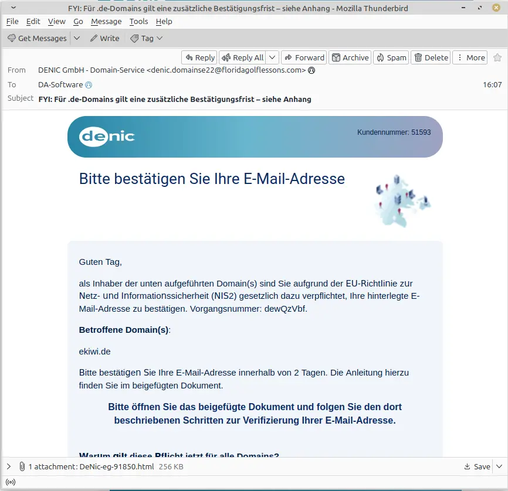
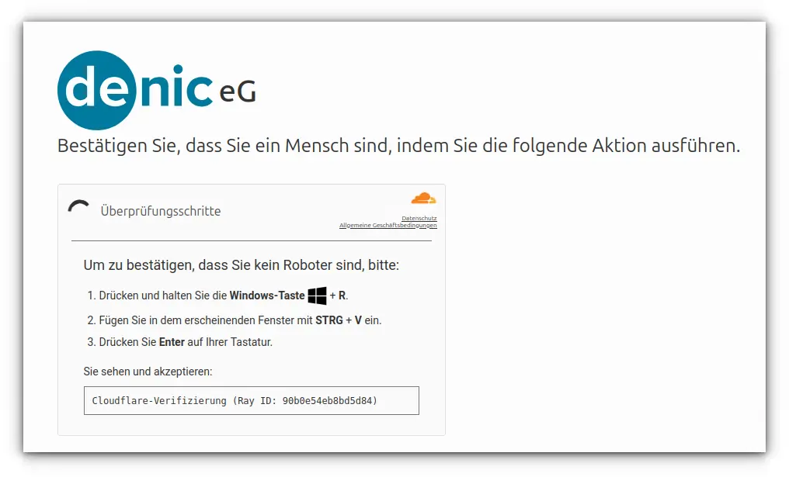

Eine angebliche Nachricht von DENIC fordert uns auf, die E-Mail-Adresse unserer `.de`-Domain zu bestätigen. Zwei Tage Zeit, sonst drohe die Abschaltung. Im Anhang liege natürlich die rettende Anleitung. Wie praktisch. 📎

Tatsächlich führt die angehängte HTML-Datei zu einer **ClickFix-Attacke**. Wer die dort verlangten Tastenkombinationen ausführt, bestätigt nicht seine Domain, sondern startet möglicherweise einen Schadcode-Befehl auf dem eigenen Rechner.

## Die gefälschte DENIC-Mail

Die Nachricht nennt sogar unsere echte Domain. Das macht sie persönlicher, aber nicht echter. Absender ist `denic.domainse22@floridagolflessons.com` – eine Adresse, bei der selbst der Golfball vermutlich im Spam-Ordner landet.

In der Mail heißt es unter anderem:

> FYI: Für .de-Domains gilt eine zusätzliche Bestätigungsfrist – siehe Anhang
>
> als Inhaber der unten aufgeführten Domain(s) sind Sie aufgrund der EU-Richtlinie zur Netz- und Informationssicherheit (NIS2) gesetzlich dazu verpflichtet, Ihre hinterlegte E-Mail-Adresse zu bestätigen. Vorgangsnummer: dewQzVbf.
>
> Betroffene Domain(s):
>
> ekiwi.de
>
> Bitte bestätigen Sie Ihre E-Mail-Adresse innerhalb von 2 Tagen. Die Anleitung hierzu finden Sie im beigefügten Dokument.
>
> Bitte öffnen Sie das beigefügte Dokument und folgen Sie den dort beschriebenen Schritten zur Verifizierung Ihrer E-Mail-Adresse.
>
> Sollte eine Verifizierung innerhalb der 2-tägigen Frist nicht erfolgen, wird die Domain-Registry DENIC eine weitere 2-tägige Frist zur Verifizierung Ihrer E-Mail-Adresse gewähren. Sollte innerhalb dieser Frist die Verifizierung nicht erfolgen, wird die Domain seitens DENIC für weitere 90 Tage diskonnektiert und löst nicht mehr auf.
>
> Beste Grüße  
> Markus Hoffmann  
> DENIC eG

Der Köder funktioniert, weil er einen wahren Kern besitzt: Nach NIS2 müssen Registrierungsdaten von Domaininhabern korrekt und vollständig sein. Die echte DENIC warnt inzwischen jedoch ausdrücklich vor gefälschten Verifizierungs-Mails. **Echte DENIC-Nachrichten kommen immer von einer Adresse unter `denic.de`; die Verifizierung selbst läuft ausschließlich über den eigenen Provider.**

Weitere Auffälligkeiten liefert die Mail gleich im Großpack:

* Der sichtbare Name behauptet „DENIC GmbH“, unterschrieben wird dagegen mit „DENIC eG“.
* Im Text stecken zahlreiche fremde Unicode-Zeichen, die lateinischen Buchstaben nur ähneln. Das soll Filter austricksen.
* Erst bleiben angeblich zwei Tage, später plötzlich 89 Tage und dann noch einmal zwei plus 90 Tage. Fristen-Bingo statt Vertragsverwaltung.
* Die „Anleitung“ kommt als HTML-Anhang. Für eine E-Mail-Bestätigung wäre das ein erstaunlich umständlicher Zirkus.

Laut den [offiziellen Informationen zur Inhaberdaten-Verifizierung](https://www.denic.de/produkte/inhaberdatenverifizierung/allgemeine-informationen/) nennt DENIC bei echten Aufforderungen Fristen von **5 oder 76 Tagen**, nicht zwei Tagen. Bei Zweifeln sollte man den Anhang geschlossen lassen und den eigenen Provider über einen selbst aufgerufenen Kontaktweg ansprechen.

## Im Anhang wartet ClickFix

Nach dem Öffnen der HTML-Datei erscheint eine nachgebaute DENIC-Seite mit einer angeblichen Cloudflare-Prüfung:

Um zu beweisen, dass man kein Roboter sei, soll man `Windows + R` drücken, mit `Strg + V` etwas einfügen und anschließend `Enter` betätigen. Kein seriöses Captcha braucht den Windows-Ausführen-Dialog. Der Klick auf die vermeintliche Prüfung legt einen vorbereiteten Befehl in die Zwischenablage; mit den drei Schritten führt das Opfer ihn selbst aus. 🤖

Das Verfahren heißt **ClickFix**. Die ausführliche technische Angriffskette haben wir bereits in unserem Artikel [ClickFix-Angriff: Ein falscher Pfändungsbeschluss installiert Malware](/posts/2026-09-22-clickfix/) analysiert. Die Kulisse ist diesmal DENIC statt Finanzamt, der Trick bleibt derselbe.

## Was tun?

**Nur die Mail erhalten:** Anhang nicht öffnen, Nachricht löschen oder als Phishing melden. Bei echtem Klärungsbedarf den Provider direkt über dessen bekannte Website kontaktieren.

**HTML-Datei geöffnet, aber nichts eingefügt:** Seite schließen und den Inhalt der Zwischenablage überschreiben. Bei einem Firmengerät vorsichtshalber die IT informieren.

**Befehl eingefügt und ausgeführt:** Netzwerkverbindung trennen, Gerät nicht weiter benutzen und sofort IT beziehungsweise Incident Response einschalten. Passwörter von einem sauberen Gerät ändern und aktive Sitzungen beenden. Ein einfacher Virenscan allein ist hier keine verlässliche Entwarnung.

## Fazit

NIS2 und die Verifizierung von Domaininhaberdaten sind real. Diese Mail ist es nicht. Wer zur Bestätigung einer Domain plötzlich den Windows-Ausführen-Dialog öffnen soll, hat keine Verwaltungsaufgabe vor sich, sondern eine sehr schlechte Idee mit Firmenlogo. **Fenster schließen – das ist in diesem Fall die einzig richtige Tastenkombination.**

