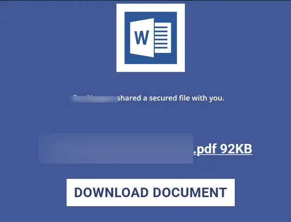
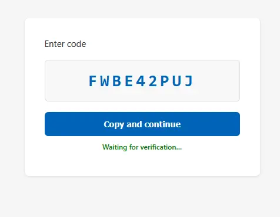

Phishing-Mails, bei denen man auf eine gefälschte Seite gelockt wird, um dort sein Passwort einzugeben, sind kalter Kaffee. Moderne Sicherheitsfilter erkennen solche Seiten schnell, und die Zwei-Faktor-Authentisierung (2FA / MFA) per SMS oder App blockiert den Zugriff für Angreifer meist im letzten Moment. 

Doch Cyberkriminelle schlafen nicht. Aktuell lässt sich eine massive Welle von Phishing-Angriffen beobachten, die eine eigentlich legitime Funktion von Microsoft missbraucht: den **Device Code Flow**. Das Perfide daran: Der Scammer benötigt dafür weder dein Passwort, noch scheitert er an deiner Zwei-Faktor-Authentisierung.

---

## Die Masche: Was sieht das Opfer?

Alles beginnt meist mit einer täuschend echt aussehenden E-Mail (oft getarnt als wichtige Systembenachrichtigung oder Newsletter). Klickt das Opfer auf den Link, landet es auf einer professionell gestalteten Landingpage. Anstatt nach einem Passwort zu fragen, präsentiert die Seite jedoch folgendes Bild:

Die Seite fordert den Nutzer auf, einen angezeigten Code (im Beispiel oben: `FWBE42PUJ`) zu kopieren und fortzufahren. Darunter läuft ein Live-Status mit der Meldung *"Waiting for verification..."*.

Klickt man auf den Button, wird man auf eine echte Microsoft-Anmeldeseite weitergeleitet, gibt dort den Code ein, bestätigt den Login – und in genau diesem Moment ist das eigene Konto kompromittiert.

---

## Der Blick hinter die Kulissen: Warum ist das so gefährlich?

Diese Angriffsart (auch bekannt als *OAuth Device Code Flow Abuse*) ist technisch extrem elegant und deshalb brandgefährlich. Der Ablauf im Hintergrund verdeutlicht, warum herkömmliche Schutzmaßnahmen hier versagen:

### 1. Tarnung durch Marketing-Infrastruktur
Um Sicherheitsfilter von E-Mail-Providern zu umgehen, nutzen Angreifer oft gemietete oder kompromittierte Accounts bei bekannten Marketing- und Newsletter-Plattformen (wie z. B. `ac-page.com` von ActiveCampaign). 
Zusätzlich werden harmlos klingende Tracking-Domains registriert (z. B. `engagementthroughconsistency.de`), die über kryptische Pfade und IDs direkt mit der E-Mail-Adresse des Opfers verknüpft sind. Für Sicherheits-Scanner sieht der Link aus wie ein ganz normaler, legitimer Newsletter-Link.

### 2. Der Code kommt direkt von Microsoft
Sobald das Opfer den Link anklickt, funkt der Server des Angreifers in Millisekunden die echten Microsoft-Server an und behauptet: *"Ich bin ein neues Gerät (z. B. ein Smart-TV oder ein Drucker) und möchte mich mit einem Konto verbinden."* 

Microsoft generiert daraufhin einen **echten, legitimen Code** und schickt ihn an den Angreifer. Die Phishing-Seite reicht diesen Code einfach nur an das Opfer weiter. **Der Code auf dem Screenshot ist also nicht gefälscht – er ist absolut echt.**

### 3. Aushebelung von Passwörtern und 2FA
Wenn das Opfer nun der Aufforderung folgt, den Code auf der echten Microsoft-Seite (`microsoft.com/devicelogin`) eingibt und sich dort in sein Konto einloggt, passiert Folgendes:

* Das Opfer authentifiziert sich auf seinem eigenen, sicheren Gerät (inklusive Passworteingabe und Bestätigung der gewohnten 2FA-App).
* Microsoft denkt: *"Super, der Nutzer hat den Zugriff für das neue Gerät freigegeben."*
* Da der Code jedoch über die Session des Angreifers generiert wurde, erhält **der Server des Scammers** im selben Moment das sogenannte *Access- und Refresh-Token* für das Konto.

Der Angreifer ist damit ohne die Kenntnis des Passworts und vollständig am zweiten Faktor vorbei mitten im Konto des Opfers – und kann sich dank des Tokens oft wochenlang darin bewegen, ohne dass eine erneute Anmeldung nötig ist.

---

## Wie kann man sich schützen?

* **Gesunde Skepsis bei Geräte-Codes:** Der "Device Code Flow" ist ausschließlich dafür gedacht, Microsoft-Dienste auf Geräten einzurichten, die keine komfortable Tastatureingabe erlauben (z. B. Smart-TVs, Spielekonsolen oder Konferenzraum-Hardware). Wenn Sie an Ihrem PC oder Notebook im Browser arbeiten, wird Microsoft Sie **niemals** nach einem solchen Code fragen.
* **URLs prüfen:** Achten Sie penibel darauf, woher Links in E-Mails führen. Auch wenn die finale Eingabe des Codes auf einer echten Microsoft-Seite stattfindet – der Weg dorthin über obskure Drittanbieter-Domains verrät den Betrug.
* **Admins in der Pflicht:** In Unternehmens- und Organisations-Netzwerken (Microsoft 365 / Azure) lässt sich der Device Code Flow über Richtlinien für den bedingten Zugriff (*Conditional Access*) einschränken oder für normale Benutzer komplett deaktivieren. Dies ist die effektivste Maßnahme, um diese Angriffsfläche dauerhaft zu schließen.